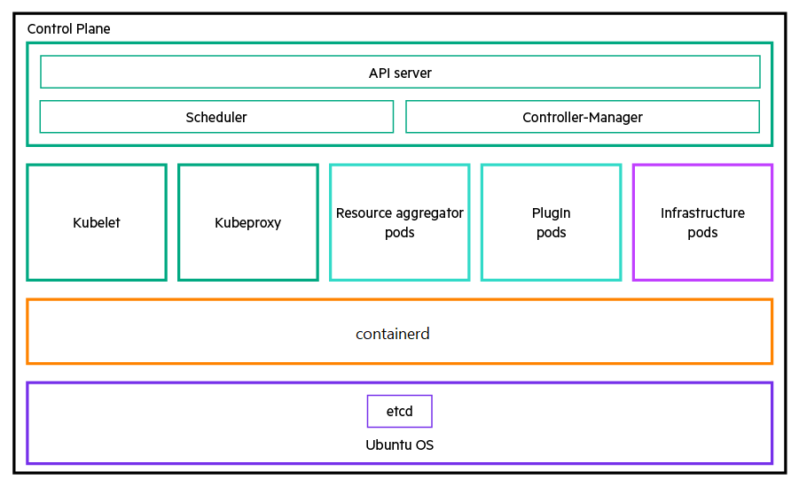
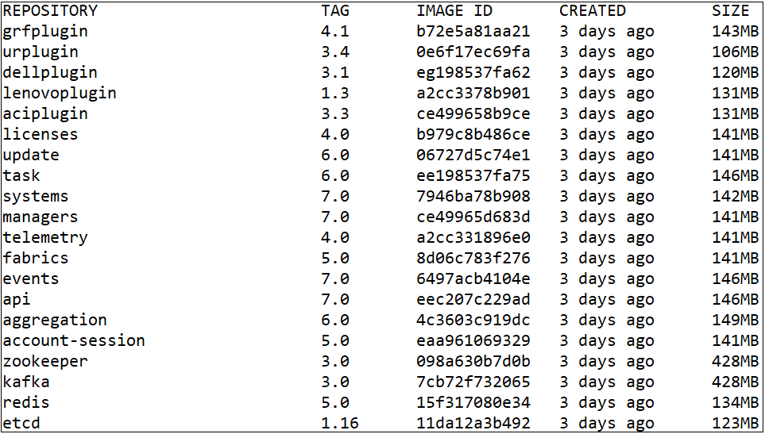

[](https://github.com/ODIM-Project/ODIM/actions)
[](https://github.com/ODIM-Project/ODIM/actions)

# Table of contents

1. [Resource Aggregator for ODIM](#resource-aggregator-for-odim)
   - [Resource Aggregator for ODIM deployment requirements](#resource-aggregator-for-odim-deployment-requirements)
   - [Deployment guidelines](#deployment-guidelines)
2. [Resource Aggregator for ODIM compatibility matrix](#resource-aggregator-for-odim-compatibility-matrix)
3. [Resource Aggregator for ODIM pre-deployment operations](#Resource-Aggregator-for-ODIM-pre-deployment-operations)
   - [Setting up the environment](#setting-up-the-environment)
   - [Pulling Docker images of all Kubernetes microservices](#pulling-docker-images-of-all-kubernetes-microservices)
   - [Building Docker images of all services](#building-docker-images-of-all-services)
   - [Updating additional package versions](#updating-additional-package-versions)
   - [Generating encrypted passwords for nodes and Redis](#generating-encrypted-passwords-for-nodes-and-Redis)
   - [Configuring log path for odim-controller](#configuring-log-path-for-odim-controller)
4. [Deploying Resource Aggregator for ODIM and the plugins](#deploying-resource-aggregator-for-odim-and-the-plugins)
   - [Deploying the resource aggregator services](#deploying-the-resource-aggregator-services)
   - [Deploying the Unmanaged Rack Plugin](#deploying-the-unmanaged-rack-plugin)
   - [Deploying the Dell plugin](#deploying-the-dell-plugin)
   - [Deploying the Lenovo plugin](#deploying-the-lenovo-plugin)
   - [Deploying the Cisco ACI plugin](#deploying-the-cisco-aci-plugin)
   - [Adding a plugin into the Resource Aggregator for ODIM framework](#adding-a-plugin-into-the-resource-aggregator-for-odim-framework)
5. [Resource Aggregator for ODIM post-deployment operations](#Resource-Aggregator-for-ODIM-post-deployment-operations)
   - [Scaling up the resources and services of Resource Aggregator for ODIM](#scaling-up-the-resources-and-services-of-resource-aggregator-for-odim)
   - [Scaling down the resources and services of Resource Aggregator for ODIM](#scaling-down-the-resources-and-services-of-resource-aggregator-for-odim)
   - [Rolling back to an earlier deployment revision](#rolling-back-to-an-earlier-deployment-revision)
   - [Upgrading the Resource Aggregator for ODIM deployment](#upgrading-the-resource-aggregator-for-odim-deployment)
6. [Use cases for Resource Aggregator for ODIM](#use-cases-for-resource-aggregator-for-odim)
   - [Adding a server into the resource inventory](#adding-a-server-into-the-resource-inventory)
   - [Viewing the resource inventory](#viewing-the-resource-inventory)
   - [Configuring BIOS settings for a server](#configuring-bios-settings-for-a-server)
   - [Resetting a server](#resetting-a-server)
   - [Setting one time boot path for a server](#setting-one-time-boot-path-for-a-server)
   - [Searching the inventory for specific servers](#searching-the-inventory-for-specific-servers)
   - [Updating software and firmware](#updating-software-and-firmware)
   - [Subscribing to southbound events](#subscribing-to-southbound-events)
   - [Viewing network fabrics](#viewing-network-fabrics)
   - [Creating and deleting volumes](#creating-and-deleting-volumes)
   - [Removing a server from the resource inventory](#removing-a-server-from-the-resource-inventory)
7.  [Using odim-controller command-line interface](#using-odim-controller-command-line-interface)
8. [Contributing to the open source community](#contributing-to-the-open-source-community)
   - [Creating a PR](#creating-a-pr)
   - [Filing Resource Aggregator for ODIM defects](#filing-resource-aggregator-for-odim-defects)
   - [Adding new plugins and services](#adding-new-plugins-and-services)
   - [Licensing](#licensing)
   - [Reference links](#reference-links)
9. [Appendix](#appendix)
   - [Setting proxy configuration](#setting-proxy-configuration)
   - [Setting up time sync across nodes](#setting-up-time-sync-across-nodes)
   - [Downloading and installing Go language](#downloading-and-installing-go-language)
   - [Configuring proxy for Docker](#configuring-proxy-for-docker)
   - [Installing Docker](#installing-docker)
   - [Sample configuration file](#sample-configuration-file)
   - [Odim-controller configuration parameters](#odim-controller-configuration-parameters)
   - [Running curl commands on a different server](#Running-curl-commands-on-a-different-server)
   - [Plugin configuration parameters](#plugin-configuration-parameters)
   - [Resource Aggregator for ODIM deployment names](#resource-aggregator-for-odim-deployment-names)
   - [Using protoc compiler](#using-protoc-compiler)
   - [Using your own CA certificates and keys](#using-your-own-ca-certificates-and-keys)
   - [Regenerating certificates](#regenerating-certificates)
     + [Updating Kafka password and certificate](#updating-kafka-password-and-certificate)
     + [Updating Zookeeper password and certificate](#updating-zookeeper-password-and-certificate)
     + [Updating certificates with SAN entries](#updating-certificates-with-san-entries)
   - [Updating etcHostsEntries in the containers](#updating-etcHostsEntries-in-the-containers)
   - [Appending CA certificates to the existing Root CA certificate](#appending-ca-certificates-to-the-existing-root-ca-certificate)
   - [Resource Aggregator for ODIM default ports](#resource-aggregator-for-odim-default-ports)
   - [Deploying the GRF plugin](#deploying-the-grf-plugin)
   - [Replacing an unreachable controller node with a new one](#replacing-an-unreachable-controller-node-with-a-new-one)
   - [Replacing an unreachable controller node with an existing worker node](#replacing-an-unreachable-controller-node-with-an-existing-worker-node)
   - [Removing an existing plugin](#removing-an-existing-plugin)
   - [Uninstalling the resource aggregator services](#uninstalling-the-resource-aggregator-services)
   - [CI process](#ci-process)
      + [GitHub action workflow details](#GitHub-action-workflow-details)
      + [Screenshots of the checks after execution](#Screenshots-of-the-checks-after-execution)


# Resource Aggregator for ODIM

Resource Aggregator for Open Distributed Infrastructure Management \(Resource Aggregator for ODIM™) is a modular, open framework for simplified management and orchestration of distributed physical infrastructure.

Resource Aggregator for ODIM comprises the following two key components:

-    The resource aggregation function:

     The resource aggregation function is the single point of contact between the northbound clients and the southbound infrastructure. Its primary function is to build and maintain a central resource inventory. It exposes Redfish-compliant APIs to allow northbound infrastructure management systems to:
     -  Get a unified view of the southbound compute, local storage, and Ethernet switch fabrics available in the resource inventory
     -   Gather crucial configuration information about southbound resources
     -   Manipulate groups of resources in a single action
     -   Listen to similar events from multiple southbound resources

 - One or more plugins:

   The plugins abstract, translate, and expose southbound resource information to the resource aggregator through RESTful APIs. Resource Aggregator for ODIM supports:

    -  Generic Redfish plugin for ODIM (GRF plugin): This plugin can be used for any Redfish-compliant device
    -  Dell plugin for ODIM: Plugin for managing Dell servers
   -  Plugin for unmanaged racks \(URP): This plugin acts as a resource manager for unmanaged racks.
   -  Cisco ACI plugin: Plugin for managing Cisco ACI servers
   -  Integration of additional third-party plugins
   
   Resource Aggregator for ODIM allows third parties to easily develop and integrate their plugins into its framework. For more information, see *[Resource Aggregator for Open Distributed Infrastructure Management™ Plugin Developer's Guide](https://github.com/ODIM-Project/ODIM/blob/development/plugin-redfish/README.md)*.
   
   

## Resource Aggregator for ODIM deployment requirements

Deploying Resource Aggregator for ODIM in a data center involves installing the following microservices on one or more machines:

-   Kubernetes microservices
-   The resource aggregator microservices:
    - API
    - Account-session
    - Aggregation
    - Events
    - Fabrics
    - Managers
    - Systems
    - Tasks
    - Update
    - Telemetry
-   The plugin microservices such as the Dell plugin, URP, and additional third-party plugins
-   Third-party services such as Kafka, etcd, Zookeeper, and Redis

These microservices can be deployed as portable, light-weight Docker containers. The containerized services are orchestrated and managed by Kubernetes—an open-source container orchestration platform that helps to automate, scale, and manage a containerized application. For more information on Kubernetes and its architecture, see *[https://kubernetes.io/docs/home/](https://kubernetes.io/docs/home/)*.

The following diagram illustrates how Resource Aggregator for ODIM is deployed and used in a Kubernetes environment. It indicates a cluster with three controller nodes (Node 1, Node 2 and Node 3) and any additional worker nodes can be added into the cluster.


To deploy Resource Aggregator for ODIM, you will require:

-   One virtual machine \(VM\) or a physical machine called the deployment node to deploy Kubernetes and Resource Aggregator for ODIM microservices. You can deploy the Resource Aggregator for ODIM microservices using the odim-controller command-line utility and use commands to:
    -   Set up the Docker environment
    -   Set up a Kubernetes cluster
    -   Deploy the containerized Resource Aggregator for ODIM microservices and third-party services on the Kubernetes cluster nodes
    -   Manage the Resource Aggregator for ODIM deployment
    
- One or more physical or virtual machines called cluster nodes where the containerized Resource Aggregator for ODIM microservices and third-party services are deployed as pods.
  The cluster nodes include controller and additional worker nodes to share the extra load. The controller node in a cluster also functions as a worker node. A cluster can have either one or three controller nodes. A cluster with three controller nodes provides a high availability environment. In addition, you can add worker nodes into the cluster to scale up the resources and the services.

  Each controller node has the following components:

  -   An underlying Ubuntu OS platform
  -   The Docker container engine
  -   The resource aggregator and the plugin microservice pods
  -   The infrastructure pods containing all the third-party services
  -   Kubelet, Kubeproxy, and the Kubernetes control plane comprising the API server, Scheduler, and the Controller-Manager

  For more information on these Kubernetes components, see  *[https://kubernetes.io/docs/concepts/overview/components/](https://kubernetes.io/docs/concepts/overview/components/)*


The following diagram is a logical representation of each controller node in a Kubernetes cluster.



The northbound management and orchestration systems access the Resource Aggregator for ODIM services through a virtual IP address \(VIP\) configured on the Kubernetes cluster using Keepalived. Communication between Resource Aggregator for ODIM and the southbound infrastructure happens through the same VIP.

Nginx acts as a reverse-proxy for the cluster nodes. Keepalived and Nginx together help in implementing high availability of the Resource Aggregator for ODIM services on the cluster nodes for both northbound management applications and southbound infrastructure.

## Deployment guidelines

Consider the following guidelines while deploying Resource Aggregator for ODIM:

-   A deployment node is required to deploy Kubernetes and Resource Aggregator for ODIM microservices.

-   The following two deployment configurations are supported:

    -  **One-node cluster configuration**:
	   This configuration has only one cluster node that also functions as a worker node. It does not support scaling of the Resource Aggregator for ODIM resources and services. This implies you cannot add worker nodes in a one-node cluster.

    -  **Three-node cluster configuration**:
	   This configuration has three cluster nodes that also function as worker nodes for sharing the extra load. It provides high availability environment by allowing the scaling of the Resource Aggregator for ODIM resources and services. This implies you can add worker nodes and increase the number of service instances running in a three-node cluster.
    
    To convert an existing one-node cluster into a three-node cluster, you must reset the one-node deployment first, and then modify the required parameters in the odim-controller configuration file.
    
    > **NOTE**:  Resetting the existing deployment clears all data related to it.

-   Do not remove the controller nodes of a Kubernetes cluster.

-   The GRF plugin is not meant for use in a production environment. Use it as reference while developing third-party plugins.

-   Scaling of the third-party services—Kafka and Redis clusters is not supported.

-   At least one instance of a resource aggregator service and a plugin service is running in the cluster. The maximum number of instances of a resource aggregator service and a plugin service that are allowed to run in a cluster is 10.

# Resource Aggregator for ODIM compatibility matrix

The following table lists the software components and versions that are compatible with Resource Aggregator for ODIM.

|Software|Version|
|--------|-------|
|etcd| 3.4.15            |
|Java JRE|11|
|Kafka|3.1.0|
|Redis|6.2.6|
|Ubuntu LTS|20.04.4|
|ZooKeeper|3.7.0|
|Docker|20.10.12|
|Ansible|2.9.6|
|Kubernetes|1.23.5|
|Kubespray|2.18.1|
|Helm charts|3.9.2|
|Nginx|1.18.0-0ubuntu1.3|
|Keepalived|1:2.0.19.2|
|Stakater/Reloader|v0.0.76|
|Redfish Schema|2022.1|
|Redfish Specification|1.15.1|


# Resource Aggregator for ODIM pre-deployment operations

1. [Setting up the environment](#setting-up-the-environment)
2. [Pulling Docker images of all Kubernetes microservices](#Pulling-Docker-images-of-all-Kubernetes-microservices)
3. [Building Docker images of all services](#building-docker-images-of-all-services)
4. [Updating additional package versions](#updating-additional-package-versions)
5. [Generating encrypted passwords for nodes and Redis](#generating-encrypted-passwords-for-nodes-and-Redis)
6. [Configuring log path for odim-controller](#configuring-log-path-for-odim-controller)

## Setting up the environment

#### **Hardware Prerequisites**

- Single deployment node with a minimum RAM of 8 GB (8192MB\), three CPUs, and 100 GB of Hard Disk Drive (HDD)

- Cluster nodes:
    - To add 1000 servers or less, you require nodes having 12 GB (12288 MB) RAM, 8 CPU cores and 16 threads, and 200 GB HDD each

    - To add 5000 servers or less, you require nodes having 32 GB (32768 MB) RAM, 16 CPU cores and 32 threads, and 200 GB HDD each


1. Download and install `ubuntu-20.04.4-live-server-amd64.iso` on the deployment node and all the cluster nodes. 
    During installation, configure the IP addresses of cluster nodes to reach the management VLANs where devices are connected. Ensure there is no firewall or switches blocking the connections and ports.

   <blockquote>
    IMPORTANT: Ensure you create the same non-root username and password on all the cluster nodes during the installation of OS.
    </blockquote>
   
2. Verify that the time across all the nodes are synchronized. See *[Setting up time sync across nodes](#setting-up-time-sync-across-nodes)*. 

3. If the nodes are behind a corporate proxy or firewall, *[set your proxy configuration](#setting-proxy-configuration)* on the deployment node and all the cluster nodes. 

4. Ensure that you are able to download the external packages through `apt-get`. 

5. Install packages such as Python, Java, Ansible, and more on the deployment node:

   1. ```
      sudo apt-get update
      ```

   2. ```
      sudo apt-get install sshpass=1.06-1 -y
      ```
      
   3. ```
      sudo apt-get install python3.8=3.8.10-0ubuntu1~20.04.5 -y
      ```

   4. ```
      sudo apt-get install python3-pip=20.0.2-5ubuntu1.6 -y
      ```

   5. ```
      sudo apt-get install software-properties-common=0.99.9.8 -y
      ```

   6. ```
      sudo -E apt-add-repository ppa:ansible/ansible -y
      ```

   7. ```
      sudo apt-get install openjdk-11-jre-headless=11.0.16+8-0ubuntu1.20.04 -y
      ```

   8. ```
      python3 -m pip install --upgrade pip
      ```

   9. ```
      sudo -H pip3 install ansible==2.9.6 --proxy=${http_proxy}
      ```

   10. ```
       sudo -H pip3 install jinja2==2.11.1 --proxy=${http_proxy}
       ```
       
   11. ```
       sudo -H pip3 install netaddr==0.7.19 --proxy=${http_proxy}
       ```

   12. ```
       sudo -H pip3 install pbr==5.4.4 --proxy=${http_proxy}
       ```

   13. ```
       sudo -H pip3 install hvac==0.10.0 --proxy=${http_proxy}
       ```

   14. ```
       sudo -H pip3 install jmespath==0.9.5 --proxy=${http_proxy}
       ```

   15. ```
       sudo -H pip3 install ruamel.yaml==0.16.10 --proxy=${http_proxy}
       ```

   16. ```
       sudo -H pip3 install pyyaml==5.3.1 --proxy=${http_proxy}
       ```
   17. ```
       sudo -H pip3 install pycryptodome==3.4.3 --proxy=${http_proxy}
       ```

   18. ```
       sudo -H pip3 install cryptography==3.4.8 --proxy=${http_proxy}
       ```

   > **NOTE**: If a package version is unavailable or outdated, run the following command to view the latest available versions of that package and install the first version listed in the output.

   ​	`sudo apt-cache madison <package name>`

6. *[Download and install go-language](#downloading-and-installing-go-language)* on the deployment node.

7. *[Configure Docker proxy](#configuring-docker-proxy)* on the deployment node.

8. *[Install Docker](#installing-docker)* on the deployment node.

9. Install Helm package on the deployment node:
    1. Create a directory called `helm` to store the Helm tool installation script.

        ```
        mkdir ~/helm
        ```

    2. Navigate to the directory.

        ```
        cd ~/helm
        ```

    3. Fetch the latest Helm installation script.

        ```
        curl -fsSL -o get_helm.sh https://raw.githubusercontent.com/helm/helm/master/scripts/get-helm-3 | /bin/bash
        ```

    4. Change permissions of the Helm installation script file.

        ```
        chmod 0700 get_helm.sh
        ```

    5. Run the Helm installation script.

        ```
        /bin/bash get_helm.sh
        ```


## Pulling Docker images of all Kubernetes microservices

1. On the deployment node, pull the Docker images of all the Kubernetes microservices:

   ```
   docker pull <imagename>:<version>
   ```
   
   Example: `docker pull quay.io/calico/cni:v3.20.3`
   
   The following table lists the Docker images of all the Kubernetes microservices.
   
   |Docker image name|Version|Docker image file name|
   |-----|----|-----|
   |k8s.gcr.io/kube-apiserver|v1.23.5 |k8s.gcr.io_kube-apiserver.tar |
   |k8s.gcr.io/kube-controller-manager|v1.23.5 |k8s.gcr.io_kube-controller-manager.tar |
   |k8s.gcr.io/kube-proxy| v1.23.5 |k8s.gcr.io_kube-proxy.tar |
   |k8s.gcr.io/kube-scheduler| v1.23.5 |k8s.gcr.io_kube-scheduler.tar |
   |quay.io/calico/node| v3.20.3 |quay.io_calico_node.tar |
   |quay.io/calico/pod2daemon-flexvol| v3.20.3 |quay.io_calico_pod2daemon-flexvol.tar |
   |quay.io/calico/cni| v3.20.3 |quay.io_calico_cni.tar |
   |quay.io/calico/kube-controllers| v3.20.3 |quay.io_calico_kube-controllers.tar |
   |k8s.gcr.io/dns/k8s-dns-node-cache|1.21.1 |k8s.gcr.io_dns_k8s-dns-node-cache.tar |
   |k8s.gcr.io/pause|3.4.1 |k8s.gcr.io_pause.tar |
   |nginx|1.21.4 |nginx.tar |
   |k8s.gcr.io/coredns/coredns|v1.8.0 |k8s.gcr.io_coredns_coredns.tar |
   |quay.io/coreos/etcd|v3.4.13 |quay.io_coreos_etcd.tar |
   |k8s.gcr.io/cpa/cluster-proportional-autoscaler-amd64|1.8.5 |k8s.gcr.io_cpa_cluster-proportional-autoscaler-amd64.tar |
   | lachlanevenson/k8s-helm                              |v3.2.3 |lachlanevenson_k8s-helm.tar |
   
2. Verify you have successfully pulled all the images.
   ```
   docker images
   ```
   
   You get an output similar to the following sample:
   
   
   
3. Save each Docker image to a tar archive:

    ```
    docker save -o <Docker image file name> <Docker image name>
    ```
    Example: `docker save -o quay.io_calico_node.tar quay.io/calico/node` 

4. Copy each saved tar archive to a directory called `kubernetes_images` on the deployment node. 

   For example:`cp /home/bruce/*.tar /home/bruce/kubernetes_images`

   > **IMPORTANT**: When deploying ODIMRA, update the `kubernetesImagePath` parameter in `kube_deploy_nodes.yaml` file with the path of the `kubernetes_images` directory you choose in this step. The images are automatically installed on all cluster nodes after deployment.

   The `kube_deploy_nodes.yaml` file is the configuration file used by odim-controller to set up a Kubernetes cluster and to deploy the Resource Aggregator for ODIM services.
   
   > **NOTE**: Verify the permissions of the archived tar files of the Docker images; the privilege of all files must be `user:docker`.


## Building Docker images of all services

1. Run the following commands on the deployment node:
   1. ```
      git clone https://github.com/ODIM-Project/ODIM.git
      ```
      
   2. ```
      cd ODIM
      ```
      
   3. ```
      export ODIMRA_USER_ID=2021
      ```
	   
   4. ```
      export ODIMRA_GROUP_ID=2021
      ```
      
   5. ```
      ./build_images.sh
	   ```
	   
	6. ```
	   sudo docker images
	   ```
	   If the images are built successfully, you get an output similar to the following sample:
	   
	   
	   
	7. Pull the reloader and busybox images:
	   
	   ```
	   docker pull stakater/reloader:v0.0.76
	   
	   docker pull busybox:1.33
	   ```
	
2. Save the Docker images of all Resource Aggregator for ODIM services to a tar archive.

    ```
    docker save -o <image_name.tar> <image_name>:<version>
    ```
    Example: `docker save -o api.tar api:4.0`

    The following table lists the Docker images of all Resource Aggregator for ODIM services:
    
    | **Docker image name** | **Version** | **Docker image bundle name** |
    | :-------------------- | ----------- | ---------------------------- |
    | account-session       | 3.1         | account-session.tar          |
    | aggregation           | 4.0         | aggregation.tar              |
    | api                   | 4.0         | api.tar                      |
    | events                | 4.0         | events.tar                   |
    | fabrics               | 3.1         | fabrics.tar                  |
    | managers              | 4.0         | managers.tar                 |
    | systems               | 4.0         | systems.tar                  |
    | composition-service   | 1.0         | composition-service.tar      |
    | licenses              | 1.0         | licenses.tar                 |
    | task                  | 3.1         | task.tar                     |
    | update                | 3.1         | update.tar                   |
    | kafka                 | 2.0         | kafka.tar                    |
    | zookeeper             | 2.0         | zookeeper.tar                |
    | etcd                  | 1.16        | etcd.tar                     |
    | redis                 | 3.0         | redis.tar                    |
    | stakater/reloader     | v0.0.76     | stakater_reloader.tar        |
    | busybox               | 1.33        | busybox.tar                  |
    | dellplugin            | 2.1         | dellplugin.tar               |
    | lenovoplugin          | 1.1         | lenovoplugin.tar             |
    | urplugin              | 3.1         | urplugin.tar                 |
    | grfplugin             | 3.1         | grfplugin.tar                |
    | telemetry             | 2.1         | telemetry.tar                |
    
3. To install the Docker images of all services on the cluster nodes, create a directory called `odimra_images` on the deployment node and copy each tar archive to this directory. 
    For example: `cp /home/bruce/ODIM/*.tar /home/bruce/odimra_images`

    > **IMPORTANT**: While deploying ODIMRA, update the `odimraImagePath` parameter in `kube_deploy_nodes.yaml` file with the path of the `odimra_images` directory you choose in this step. The images are automatically installed on all cluster nodes after deployment.
    
    > **NOTE**: The `kube_deploy_nodes.yaml` file is the configuration file used by odim-controller to set up a Kubernetes cluster and to deploy the Resource Aggregator for ODIM services.


## Updating additional package versions

While deploying Resource Aggregator for ODIM, verify the versions of the following packages and update them if required:

- [linux-headers](#linux-headers)
- [Keepalived](#Keepalived)
- [Nginx](#Nginx)

> **NOTE**: Verify the Keepalived and Nginx package versions only in case of a three-node cluster deployment.

#### linux-headers

1. Enter the following command:

   ```
   sudo apt-cache madison linux-headers-5.8.0-63-generic
   ```

   > **NOTE**: If the above command fails with the error message, `N: Unable to locate package linuxheaders-5.8.0-63-generic`, the package version has been updated. Proceed with further steps to find the latest version.
   
2. Enter the following command:

   ```
   sudo apt-cache search --names-only "linux-headers-[0-9.-]*-generic" | tail -5 | sort -r
   ```

3. Verify if the first entry in the output list is present in the cache.

   ```
   sudo apt-cache madison <package_name>
   ```

   Example for `<package_name>` is `linux-headers-5.8.0-63-generic`

4. In case of a version mismatch, update the latest version of `linux-header` package in:

    `~/ODIM/odim-controller/odimra/group_vars/all/requirements.yaml`

#### Keepalived

1. Enter the following command:

   ```
   sudo apt-cache madison keepalived
   ```

2. Verify if the latest version is `keepalived=1:2.0.19-2`.

3. In case of a version mismatch, update the latest version of the `Keepalived` package in:
   
   `~/ODIM/odim-controller/odimra/group_vars/all/requirements.yaml`

#### Nginx

1. Enter the following command:

   ```
   sudo apt-cache madison nginx
   ```

2. Verify if the latest version is `nginx=1.18.0-0ubuntu1.2`.

3. In case of a version mismatch, update the latest version of the `Nginx` package in:
   
   `~/ODIM/odim-controller/odimra/group_vars/all/requirements.yaml`


## Generating encrypted passwords for nodes and Redis

Encrypting passwords of the local non-root user on the Kubernetes cluster nodes and Redis database makes the deployment process non-interactive. If the encrypted password is not available during deployment, you are prompted to enter the password for the first time.

Resource Aggregator for ODIM uses the odim-vault tool to encrypt and decrypt passwords.


1. On the deployment node, navigate to ~/ODIM/odim-controller/scripts.

    ```
    cd ~/ODIM/odim-controller/scripts
    ```

1. Build the odim-vault tool.
   ```
   go build -ldflags "-s -w" -o odim-vault odim-vault.go
   ```

2. Enter a random string in a file called odimVaultKeyFile and save it.

    ```
    vi odimVaultKeyFile
    ```

    The entered string acts as the odim-vault crypto key. It is required for encrypting and decrypting the local user password of the Kubernetes cluster nodes.

3. Encode the entered odim-vault crypto key: 

    ```
    ./odim-vault -encode ~/ODIM/odim-controller/\
    scripts/odimVaultKeyFile
    ```

    **Result**: odimVaultKeyFile contains the encoded odim-vault master key.

4. Change the file permissions of odimVaultKeyFile.

    ```
    chmod 0400 /home/${USER}/ODIM/odim-controller/\
    scripts/odimVaultKeyFile
    ```

5. Enter the password of the default non-root user (that you set across all cluster nodes initially) in plain text in a file called `nodePasswordFile`. 

    ```
    vi nodePasswordFile
    ```

6. Save the file. 

8. Encrypt the password: 

    ```
    ./odim-vault -key ~/ODIM/odim-controller/\
    scripts/odimVaultKeyFile -encrypt /home/${USER}/ODIM/odim-controller/\
    scripts/nodePasswordFile
    ```

    **Result**: `nodePasswordFile` contains the encrypted node password.

9. Change the file permissions of `nodePasswordFile`.

    ```
    chmod 0400 /home/${USER}/ODIM/odim-controller/\
    scripts/nodePasswordFile
    ```

10. Enter the password of the Redis in-memory database in plain text in a file called `redisInMemoryPasswordFile`.  

   ```
   vi redisInMemoryPasswordFile
   ```

11. Save the file.

12. Encrypt the password: 

    ```
    ./odim-vault -key ~/ODIM/odim-controller/\
    scripts/odimVaultKeyFile -encrypt /home/${USER}/ODIM/odim-controller/\
    scripts/redisInMemoryPasswordFile
    ```

    **Result**: `redisInMemoryPasswordFile` contains the encrypted node password.

13. Change the file permissions of `redisInMemoryPasswordFile`.

    ```
    chmod 0400 /home/${USER}/ODIM/odim-controller/\
    scripts/redisInMemoryPasswordFile
    ```

14. Enter the password of the Redis on-disk database in plain text in a file called `redisOnDiskPasswordFile`. 

    ```
    vi redisOnDiskPasswordFile
    ```

15. Save the file.

16. Encrypt the password: 

    ```
    ./odim-vault -key ~/ODIM/odim-controller/\
    scripts/odimVaultKeyFile -encrypt /home/${USER}/ODIM/odim-controller/\
    scripts/redisOnDiskPasswordFile 
    ```

    **Result**: `redisOnDiskPasswordFile` contains the encrypted node password.

17. Change the file permissions of `redisOnDiskPasswordFile`.

    ```
    chmod 0400 /home/${USER}/ODIM/odim-controller/\
    scripts/redisOnDiskPasswordFile 
    ```

## Configuring log path for odim-controller

You can provide a desired file path for the odim-controller logs by setting ODIM_CONTROLLER_LOG_PATH environment variable. Upon the execution of odim-controller, the log file is stored as `{ODIM_CONTROLLER_LOG_PATH}/odim-controller.log`.

If the environment variable is not set, the log file is stored in the current directory where odim-controller was executed.

Upon each execution of odim-controller, the following information is logged:

- Start time and end time of the execution
- User and the groups, user belongs to
- Options passed to odim-controller
- Complete output of the operation


# Deploying Resource Aggregator for ODIM and the Plugins

Topics covered in this section include:

1. [Deploying the resource aggregator services](#deploying-the-resource-aggregator-services)
2. [Deploying the Unmanaged Rack Plugin](#deploying-the-unmanaged-rack-plugin)
3. [Deploying the Dell plugin](#deploying-the-dell-plugin)
4. [Deploying the Cisco ACI plugin](#deploying-the-cisco-aci-plugin)
5. [Adding a plugin into the Resource Aggregator for ODIM framework](#adding-a-plugin-into-the-resource-aggregator-for-odim-framework)

## Deploying the resource aggregator services

**Prerequisites**: Ensure all the *[pre-deployment operations](#Resource-Aggregator-for-ODIM-pre-deployment-operations)* are complete.

1. Update the odim-controller configuration file: 
   1. Navigate to `~/ODIM/odim-controller/scripts` on the deployment node.

      ```
      cd ~/ODIM/odim-controller/scripts
      ```

   2. Copy content from the `kube_deploy_nodes.yaml.tmpl` file to the `kube_deploy_nodes.yaml` file:

      ```
      cp kube_deploy_nodes.yaml.tmpl kube_deploy_nodes.yaml
      ```
      
   3. Edit the `kube_deploy_nodes.yaml` file. 

      ```
      vi kube_deploy_nodes.yaml
      ```

      The `kube_deploy_nodes.yaml` file is the configuration file used by odim-controller to set up a Kubernetes cluster and to deploy the Resource Aggregator for ODIM services.

      > **IMPORTANT**: Do not change the format of the content in this file. Doing so might interrupt the Resource Aggregator for ODIM deployment process. 

      When you open the `kube_deploy_nodes.yaml` file for the first time, it looks like the following (for a three node cluster):

      ```
      #(C) Copyright [2020] Hewlett Packard Enterprise Development LP
      # 
      #Licensed under the Apache License, Version 2.0 (the "License"); you may
      #not use this file except in compliance with the License. You may obtain
      #a copy of the License at
      # 
      #    http://www.apache.org/licenses/LICENSE-2.0
      # 
      #Unless required by applicable law or agreed to in writing, software
      #distributed under the License is distributed on an "AS IS" BASIS, WITHOUT
      #WARRANTIES OR CONDITIONS OF ANY KIND, either express or implied. See the
      #License for the specific language governing permissions and limitations
      #under the License.
      
      deploymentID:
      httpProxy:
      httpsProxy:
      noProxy:
      nodePasswordFilePath:
      redisInMemoryPasswordFilePath:
      redisOnDiskPasswordFilePath:
      nodes:
        <Node1_Hostname>:
          ip: <Node1_IPAddress>
          ipv6: <Node1_IPv6Address>
          username: <Node1_Username>
          priority: 100
        <Node2_Hostname>:
          ip: <Node2_IPAddress>
          ipv6: <Node2_IPv6Address>
          username: <Node2_Username>
          priority: 99
        <Node3_Hostname>:
          ip: <Node3_IPAddress>
          ipv6: <Node3_IPv6Address>
          username: <Node3_Username>
          priority: 98
      nwPreference: ipv4
      odimControllerSrcPath:
      odimVaultKeyFilePath:
      odimCertsPath:
      kubernetesImagePath:
      odimraImagePath:
      odimPluginPath:
      odimra:
        groupID: 2021
        userID: 2021
        namespace: odim
        fqdn:
        rootServiceUUID:
        haDeploymentEnabled: True
        connectionMethodConf:
        - ConnectionMethodType: Redfish
          ConnectionMethodVariant: Compute:BasicAuth:GRF_v1.0.0
        etcHostsEntries:
      
        appsLogPath: /var/log/odimra
        odimraServerCertFQDNSan:
        odimraServerCertIPSan:
        odimraKafkaClientCertFQDNSan:
        odimraKafkaClientCertIPSan:
      
        apiProxyPort: 45000
        apiNodePort: 30080
        kafkaNodePort: 30092
        
        messageBusType: Kafka
        messageBusQueue: REDFISH-EVENTS-TOPIC
      
        etcdDataPath: /etc/etcd/data
        etcdConfPath: /etc/etcd/conf
        
        kafkaConfPath: /etc/kafka/conf
        kafkaDataPath: /etc/kafka/data
        kafkaJKSPassword: "K@fk@_store1"
      
        redisOndiskDataPath: /etc/redis/data/ondisk
        redisInmemoryDataPath: /etc/redis/data/inmemory
        
        resourceRateLimit:
        requestLimitPerSession:
        sessionLimitPerUser:
        
        zookeeperConfPath: /etc/zookeeper/conf
        zookeeperDataPath: /etc/zookeeper/data
        zookeeperJKSPassword: "K@fk@_store1"
      
        nginxLogPath: /var/log/nginx
        virtualRouterID: 100
        virtualIP:
        virtualIPv6:
        
        rootCACert:
        odimraServerCert:
        odimraServerKey:
        odimraRSAPublicKey:
        odimraRSAPrivateKey:
        odimraKafkaClientCert:
       odimraKafkaClientKey:
      ```

      For information on each parameter in this configuration file, see *[Odim-controller configuration parameters](#odim-controller-configuration-parameters)*.

   4. Update the following mandatory parameters in the `kube_deploy_nodes.yaml` file:

      - `httpProxy` (if your environment is behind a proxy)

      - `httpsProxy` (if your environment is behind a proxy)

      - `noProxy` (if your environment is behind a proxy)

      - `deploymentID`

      - `nodePasswordFilePath`

      - `redisInMemoryPasswordFilePath`

      - `redisOnDiskPasswordFilePath`
   
      - `nodes` (details of the single deployment node or the cluster nodes based on the type of your deployment)
   
        For three node deployment:
   
        - hostnames of node 1, node 2, and node 3

        - IP addresses of node 1, node 2, and node 3
   
        - username of node 1, node 2, and node 3
      
        - Priority values of node 1, node 2, and node 3 (mandatory if `haDeploymentEnabled` is set to true)
      
      - `nwPreference` (default value is ipv4. If `dualStack` based deployment is selected, resource aggregator API service can be reached via both IPv4 and IPv6 addresses)
      
      - `odimControllerSrcPath`
      
      - `odimVaultKeyFilePath`
      
      - `odimraImagePath`
      
      - `odimPluginPath`
      
      - `fqdn`
      
      - `rootServiceUUID`
      
      - `connectionMethodConf`
      
      - `etcHostsEntries`
      
      - `apiProxyPort` (mandatory if `haDeploymentEnabled` is set to true)
      
      - `nginxLogPath` (mandatory if `haDeploymentEnabled` is set to true)
      
      - `virtualRouterID` (mandatory if `haDeploymentEnabled` is set to true)
      
      - `virtualIP` (mandatory if `haDeploymentEnabled` is set to true)
      
      - `virtualIPv6` (mandatory if `haDeploymentEnabled` is set to true and `nwPreference` is set to `dualStack`)
   
   Other parameters can either be empty or have default values. Optionally, you can update them with values based on your requirements. See a *[sample configuration file](#sample-configuration-file)* once the parameters are updated. It is recommended to have a regular backup of this file.
   
   > **NOTE**: All parameters in the `kube_deploy_nodes.yaml` file get sorted alphabetically after the successful deployment of Resource Aggregator for ODIM services.
   
2. Set up a Kubernetes cluster by performing the following procedure: 
    1. Navigate to `odim-controller/scripts` on the deployment node: 

        ```
        cd ~/ODIM/odim-controller/scripts
        ```

    2. Run the following command on the deployment node: 

        ```
        python3 odim-controller.py --deploy \
        kubernetes --config /home/${USER}/ODIM/odim-controller/\
        scripts/kube_deploy_nodes.yaml
        ```

    3. Enable the non-root user to access the Kubernetes command-line tool \(kubectl\) on the cluster nodes. Run the following commands on each cluster node:

        ```
    	mkdir -p $HOME/.kube
        ```
        
        ```
    	sudo cp -i /etc/kubernetes/admin.conf $HOME/.kube/config
        ```
        
        ```
    	sudo chown $(id -u):$(id -g) $HOME/.kube/config
        ```

    4. Verify that the Kubernetes pods are up and running in the cluster nodes. Run the following command on each cluster node:

        ```
    	kubectl get pods -n kube-system -o wide
        ```

        Example output:

         


3. Deploy the resource aggregator services: 

    1. Log in to the deployment node and run the following command: 

        ```
        python3 odim-controller.py --deploy \
        odimra --config /home/${USER}/ODIM/odim-controller/\
        scripts/kube_deploy_nodes.yaml
        ```

        All the resource aggregator services and the third-party services are successfully deployed.

    2. Log in to each cluster node, run the following command on each cluster node to verify all deployed services are running successfully. 

        ```
        kubectl get pods -n odim -o wide
        ```

        Example output:

        
        If the services are not successfully deployed, reset the deployment and try deploying again:
        
        ```
         python3 odim-controller.py --reset odimra --config \
         /home/${USER}/ODIM/odim-controller/scripts/kube_deploy_nodes.yaml \
         --ignore-errors
        ```
        
        For a three-node cluster deployment, resetting deployment removes the virtual IP configured through Keepalived. After resetting the deployment, restart the Keepalived service. Also, ensure the parameters in the `kube_deploy_nodes.yaml `are not `NULL`. Update such parameters to `""` or as per your requirement.
         **For example**: After resetting the deployment, update the `odimCertsPath` parameter to `""` or to your actual certificate path in the `kube_deploy_nodes.yaml` file. 
        
        > **NOTE**: Save the `RootServiceUUID` in the `kube_deploy_nodes.yaml` file in the path `~/ODIM/odim-controller/scripts/kube_deploy_nodes.yaml`.
        > If the services are not successfully deployed and you want to reset the deployment, you can use the saved `RootServiceUUID`.        


4. Perform HTTP GET on `/redfish/v1` using the following curl command on your deployment node. 

   > **IMPORTANT**: Before running curl commands, unset http and https proxies, check if you have set proxy configuration. If yes, set "no_proxy" using the following commands: 
   
   ```
   unset https_proxy
   ```
   
   ```
   unset http_proxy
   ```
   
   ```
   export no_proxy="127.0.0.1,localhost,\
   localhost.localdomain,10.96.0.0/12,\
   <Comma-seperated_list_of_IP_addresses_of_the_deployment_node_and_the_cluster_nodes>"
   ```
   
   Verify that all the resource aggregator services are listed in the JSON response body by running the following curl command:

5. ```
   curl -s --cacert \ 
   {path_of_rootCA.crt} \ 
   'https://{odim_host}:{port}/redfish/v1' -k
   ```
   
   Replace `{path_of_rootCA.crt}` with the path specified for the odimCertsPath parameter in the kube\_deploy\_nodes.yaml file - `<odimcertsPath>/rootCA.crt`. The `rootCA.crt` file is required for secure SSL communication.
   
   {odim_host} is the virtual IP address of the Kubernetes cluster.
   
   > **NOTE**: For a single node cluster configuration, {odim_host} is the ip address of master node. For a three node cluster configuration, to use FQDN as `{odim_host}`, ensure that FQDN is configured to the virtual IP address in the `/etc/hosts` file or in the DNS server.
   
   {port} is the API server port configured in Nginx. Default port is `30080`. If you have changed the default port, use that as the port.
   
   The following JSON response is returned:
   
   ```
   {
      "@odata.context":"/redfish/v1/$metadata#ServiceRoot.ServiceRoot",
        	   "@odata.id":"/redfish/v1/",
        	   "@odata.type":"#ServiceRoot.v1_11_0.ServiceRoot",
        	   "Id":"RootService",
        	   "Registries":{
        	   "@odata.id":"/redfish/v1/Registries"
         	   },
               "SessionService":{
         	      "@odata.id":"/redfish/v1/SessionService"
         	   },
         	   "AccountService":{
         	      "@odata.id":"/redfish/v1/AccountService"
         	   },
         	   "EventService":{
         	      "@odata.id":"/redfish/v1/EventService"
         	   },
         	   "Tasks":{
         	      "@odata.id":"/redfish/v1/TaskService"
         	   },
         	   "TelemetryService":{
         	      "@odata.id":"/redfish/v1/TelemetryService"
         	   },
         	   "AggregationService":{
         	      "@odata.id":"/redfish/v1/AggregationService"
         	   },
         	   "Systems":{
         	      "@odata.id":"/redfish/v1/Systems"
         	   },
         	   "Chassis":{
         	      "@odata.id":"/redfish/v1/Chassis"
         	   },
         	   "Fabrics":{
         	      "@odata.id":"/redfish/v1/Fabrics"
         	   },
         	   "Managers":{
         	      "@odata.id":"/redfish/v1/Managers"
         	   },
         	   "UpdateService":{
         	      "@odata.id":"/redfish/v1/UpdateService"
         	   },
         	   "Links":{
         	      "Sessions":{
         	         "@odata.id":"/redfish/v1/SessionService/Sessions"
         	      }
         	   },
         	   "Name":"Root Service",
         	   "Oem":{
         	
         	   },
         	   "RedfishVersion":"1.15.1",
         	   "UUID":"0554d6ff-a7e7-4c94-80bd-da19125f95e5"
         	}
   ```
   
   If you want to run curl commands on a different server, follow the instructions in *[Running curl commands on a different server](#Running-curl-commands-on-a-different-server)*.
   
5. Change the password of the default administrator account of Resource Aggregator for ODIM:

   Username: **admin**

   Password: **Od!m12$4**

   To change the password, perform HTTP PATCH on the following URI:

   ```
   https://{odim_host}:{port}/redfish/v1/AccountService/Accounts/{accountId}
   ```

   Replace \{accountId\} with the username of the default administrator account.

   Post the new password in a request body as shown in the sample request:

   **Sample request**

   ```
   { 
      "Password":"Testing)9-_?{}"
   }
   ```

   Ensure that the new password meets the following requirements:

   - Your password must not be same as your username.
   - Your password must be at least 12 characters long and at most 16 characters long.
   - Your password must contain at least one uppercase letter \(A-Z\), one lowercase letter \(a-z\), one digit (0-9\), and one special character (~!@\#$%^&\*-+\_|(){}:;<\>,.?/).
     Default password is updated to the new password in the database.

6. To configure log rotation, perform the following procedure on each cluster node: 
   1. Navigate to the `/etc/logrotate.d` directory. 

      ```
      cd /etc/logrotate.d
      ```

   2. Create a file called odimra. 

   3. Open the `odimra` file, add the following content and save: 

      ```
      /var/log/grfplugin_logs/*.log
      /var/log/odimra/*.log
      /opt/keepalived/logs/action_script.log
      /opt/nginx/logs/error.log
      /opt/nginx/logs/access.log {
          hourly
          missingok
          rotate 10
          notifempty
          maxsize 1M
          compress
          create 0644 odimra odimra
          shred
          copytruncate
      }
      ```
      
      > **NOTE**: After deploying a new plugin, log in to each cluster node and open the odimra file to add the log path entry for the new plugin.
      
   4. Navigate to the `/etc/cron.hourly` directory. 

      ```
   cd /etc/cron.hourly
      ```
   
   5. Create a file called logrotate. 

   6. Open the `logrotate` file and add the following content: 

       ```
    logrotate -s /var/lib/logrotate/status /etc/logrotate.d/odimra
       ```
   
   7. Verify that the configuration is working: 

       ```
    sudo logrotate -v -f /etc/logrotate.d/odimra
       ```


## Deploying the Unmanaged Rack Plugin

**Prerequisites**: Kubernetes cluster is set up and the resource aggregator is successfully deployed.

1. Create a directory called `plugins` on the deployment node:
   
   ```
   mkdir -p ~/plugins
   ```
   
4. In the `plugins` directory, create a directory called `urplugin`:
   ```
   mkdir ~/plugins/urplugin
   ```

3. Log in to the deployment node and generate an encrypted password of Resource Aggregator for ODIM to be used in the `urplugin-config.yaml` file:

    ```
echo -n '<ODIMRA password>' |openssl pkeyutl -encrypt -inkey <odimCertsPath>/odimra_rsa.private -pkeyopt rsa_padding_mode:oaep -pkeyopt rsa_oaep_md:sha512|openssl base64 -A
    ```
    
    In this command, replace:

    -  <ODIMRA password> with the password of Resource Aggregator for ODIM \(default administrator account password\).
    -  <odimCertsPath> with the path you specified for the `<odimCertsPath>` parameter in the `kube_deploy_nodes.yaml` file.
    
    Example output:
    
    ```
    ip/jrKjQdzKIU1JvT4ZQ6gbCe2XJtCKPRgqOQv6g3aIAYtG+hpVgel3k67TB723h9dN2cABWZgE+b9CAxbIXj3qZZFWrUMMuPkT4fwtW8fTlhdR+phmOvnnSw5bvUrXyl5Se1IczwtMXfhqk7U8eqpJnZ6xWNR8Q1K7baDv1QvZwej/v3bqHRTC93pDL+3SvE8VCyrIgbMVdfvv3+mJKvs2F7hXoTJiwjRfKGyzdP0yRIHAFOB3m/xnv6ZIRm8Ak6+sx18NRq8RH20bktzhZ45fT+iX4twMJG1lI0KRJ3j/PL+IqY4MmYzv/72fQhMznL39Rjr9LR6mB/JGI0ww0sMUCFr6obzQfQWv1so+Ck694fNJMQPXQS64VcqVDuISXSd4cqkdMx9zBmfDbgzMQQVwgjDgt4nC1w8/wGSfMtkms8rSJrBa18hKCWi+jfhASbNM84udKc0kQsQJlsnjcdsL84zrE8iUqqXC/fK2cQbNL31H5C+qEfJqdNTauQSskkK3cpNWh1FVw736WBYYJSja59q5QwMniXldwcvRglEIELsjKgjbuOnQoIZaVTcbheaa2b1XAiRKTKuPmweysyV3fbuR0jgSJTmdTehrtYG9omjUbg/L7WFjC43JWq8suWi5uch+jHtGG5mZJFFdkE37pQd3wzHBSa+/9Yq9/ZSY=
    ```
    
4. On the deployment node, copy the UR plugin configuration file and the hook script to `~/plugins/urplugin`.
   ```
   cp ~/ODIM/odim-controller/helmcharts/urplugin/urplugin-config.yaml ~/plugins/urplugin
   ```

   ```
   cp ~/ODIM/odim-controller/helmcharts/urplugin/urplugin.sh ~/plugins/urplugin
   ```

5. Open the URP configuration YAML file.

    ```
    vi ~/plugins/urplugin/urplugin-config.yaml
    ```

6. Update the following parameters in the plugin configuration file: 

    - **odimUsername**: The username of the default administrator account of Resource Aggregator for ODIM.
    
    - **odimPassword**:  The encrypted password of the default administrator account of Resource Aggregator for ODIM. To generate the encrypted password, see step 3 of this procedure.
    
      Other parameters can have default values. Optionally, you can update them with values based on your requirements. For more information on each parameter, see *[Plugin configuration parameters](#plugin-configuration-parameters)*.
    
      **Sample urplugin-config.yaml file**
    
      ```
      urplugin:
        urPluginRootServiceUUID: e3473202-8706-4077-bd7d-d43d8d323a5b
        username: admin
        password: sTfTyTZFvNj5zU5Tt0TfyDYU-ye3_ZqTMnMIj-LAeXaa8vCnBqq8Ga7zV6ZdfqQCdSAzmaO5AJxccD99UHLVlQ==
        odimUsername: admin
        odimPassword: ip/jrKjQdzKIU1JvT4ZQ6gbCe2XJtCKPRgqOQv6g3aIAYtG+hpVgel3k67TB723h9dN2cABWZgE+b9CAxbIXj3qZZFWrUMMuPkT4fwtW8fTlhdR+phmOvnnSw5bvUrXyl5Se1IczwtMXfhqk7U8eqpJnZ6xWNR8Q1K7baDv1QvZwej/v3bqHRTC93pDL+3SvE8VCyrIgbMVdfvv3+mJKvs2F7hXoTJiwjRfKGyzdP0yRIHAFOB3m/xnv6ZIRm8Ak6+sx18NRq8RH20bktzhZ45fT+iX4twMJG1lI0KRJ3j/PL+IqY4MmYzv/72fQhMznL39Rjr9LR6mB/JGI0ww0sMUCFr6obzQfQWv1so+Ck694fNJMQPXQS64VcqVDuISXSd4cqkdMx9zBmfDbgzMQQVwgjDgt4nC1w8/wGSfMtkms8rSJrBa18hKCWi+jfhASbNM84udKc0kQsQJlsnjcdsL84zrE8iUqqXC/fK2cQbNL31H5C+qEfJqdNTauQSskkK3cpNWh1FVw736WBYYJSja59q5QwMniXldwcvRglEIELsjKgjbuOnQoIZaVTcbheaa2b1XAiRKTKuPmweysyV3fbuR0jgSJTmdTehrtYG9omjUbg/L7WFjC43JWq8suWi5uch+jHtGG5mZJFFdkE37pQd3wzHBSa+/9Yq9/ZSY=
        logPath: /var/log/urplugin_logs
      ```

7. Generate Helm package for URP on the deployment node:

    1. Navigate to `odim-controller/helmcharts/urplugin`:

       ```
       cd ~/ODIM/odim-controller/helmcharts/urplugin
       ```

    2. Create `urplugin` Helm package at `~/plugins/urplugin`:

       ```
       helm package urplugin -d ~/plugins/urplugin
       ```

       The Helm package for URP is created in the tgz format.

8. Save the URP Docker image on the deployment node at `~/plugins/urplugin`.

      ```
     docker save urplugin:3.0 -o ~/plugins/urplugin/urplugin.tar
     ```

9. Navigate to the `/ODIM/odim-controller/scripts` directory on the deployment node.

      ```
     cd ~/ODIM/odim-controller/scripts
     ```

10. Open the `kube_deploy_nodes.yaml` file by navigating to`~/ODIM/odim-controller/scripts`.

        vi kube_deploy_nodes.yaml

11. Specify values for the following parameters in the `kube_deploy_nodes.yaml` file: 

    | Parameter                    | Value                                                        |
    | ---------------------------- | ------------------------------------------------------------ |
    | connectionMethodConf         | The connection method associated with URP: ConnectionMethodVariant: `Compute:BasicAuth:URP_v1.0.0`<br> |
    | odimraKafkaClientCertFQDNSan | The FQDN to be included in the Kafka client certificate of Resource Aggregator for ODIM for deploying URP: `urplugin`, `api`.<br>Add these values to the existing comma-separated list.<br> |
    | odimraServerCertFQDNSan      | The FQDN to be included in the server certificate of Resource Aggregator for ODIM for deploying URP: `urplugin`, `api`.<br>Add these values to the existing comma-separated list.<br> |
    | odimPluginPath               | The path of the directory where the URP Helm package, the `urplugin` image, and the modified `urplugin-config.yaml` are copied. |

    **Example**:
    
    ```
    odimPluginPath: /home/bruce/plugins
    odimra:
      groupID: 2021
      userID: 2021
      namespace: odim
      fqdn:
      rootServiceUUID:
      haDeploymentEnabled: True
      connectionMethodConf:
      - ConnectionMethodType: Redfish
        ConnectionMethodVariant: Compute:BasicAuth:GRF_v1.0.0
      - ConnectionMethodType: Redfish
        ConnectionMethodVariant: Compute:BasicAuth:URP_v1.0.0
      odimraKafkaClientCertFQDNSan: urplugin,api
      odimraServerCertFQDNSan: urplugin,api
    ```


12. Move `odimra_kafka_client.key`, `odimra_kafka_client.crt`, `odimra_server.key`, and `odimra_server.crt` stored in `odimCertsPath` to a different folder.

    > **NOTE**: `odimCertsPath` is the absolute path of the directory where the certificates required by the services of Resource Aggregator for ODIM are present. See the *[Odim-controller configuration parameters](#odim-controller-configuration-parameters)* section in this document for more information.

13. Upgrade odimra-secrets:

    ```
    python3 odim-controller.py --config /home/${USER}/ODIM/odim-controller/scripts/kube_deploy_nodes.yaml --upgrade odimra-secret
    ```

14. Run the following command: 
    ```
    python3 odim-controller.py --config /home/${USER}/ODIM/odim-controller/scripts/kube_deploy_nodes.yaml --upgrade odimra-config
    ```

15. Install Unmanaged Rack plugin: 
    ```
    python3 odim-controller.py --config /home/${USER}/ODIM/odim-controller/scripts/kube_deploy_nodes.yaml --add plugin --plugin urplugin
    ```

16. Run the following command on the cluster nodes to verify the Unmanaged Rack plugin pod is up and running: 
    ```
    kubectl get pods -n odim
    ```
    Example output of the URP pod details:
    
    ```
    NAME 						READY 	STATUS 		RESTARTS    AGE
    urplugin-5fc4b6788-2xx97 	1/1 	Running 	0 	    	4d22h
    ```

17. *[Add URP into the Resource Aggregator for ODIM framework](#adding-a-plugin-into-the-resource-aggregator-for-odim-framework)*.


## Deploying the Dell plugin

**Prerequisites**: Kubernetes cluster is set up and the resource aggregator is successfully deployed.

1. Create a directory called `plugins` on the deployment node.
   ```
   mkdir -p ~/plugins
   ```

2. In the `plugins` directory, create a directory called `dellplugin`.
   ```
   mkdir ~/plugins/dellplugin
   ```

3. On the deployment node, copy the Dell plugin configuration file and the hook script to `~/plugins/dellplugin`.
   ```
   cp ~/ODIM/odim-controller/helmcharts/dellplugin/dellplugin-config.yaml ~/plugins/dellplugin
   ```

   ```
   cp ~/ODIM/odim-controller/helmcharts/dellplugin/dellplugin.sh ~/plugins/dellplugin
   ```
   
4. Open the Dell plugin configuration YAML file.

    ```
    vi ~/plugins/dellplugin/dellplugin-config.yaml
    ```

5. Update the following parameters in the plugin configuration file: 

    - **lbHost**: IP address of the cluster node where the Dell plugin will be installed for one node cluster configuration. For three node cluster configuration,  lbHost is the virtual IP address configured in Nginx and Keepalived.

    - **lbPort**: Default port is 30084 for one node cluster configuration. For three node cluster configuration, lbport must be assigned with a free port (preferably above 45000) available on all cluster nodes. This port is used as nginx proxy port for the plugin.

      >  **NOTE**: The lbport is used as proxy port for eventlistenernodeport, which is used for subscribing to events.
      
    - **dellPluginRootServiceUUID**: RootServiceUUID to be used by the Dell plugin service. Generate a new UUID by executing the command `uuidgen`.

      Other parameters can have default values. Optionally, you can update them with values based on your requirements. For more information on each parameter, see *[Plugin configuration parameters](#plugin-configuration-parameters)*.

      **Sample dellplugin-config.yaml file:**

      ```
      dellplugin:
       eventListenerNodePort: 30084
       dellPluginRootServiceUUID: 7a38b735-8b9f-48a0-b3e7-e5a180567d37
       username: admin
       password: sTfTyTZFvNj5zU5Tt0TfyDYU-ye3_ZqTMnMIj-LAeXaa8vCnBqq8Ga7zV6ZdfqQCdSAzmaO5AJxccD99UHLVlQ==
       lbHost: xxx.xxx.xxx.xxx
       lbPort: 30084
       logPath: /var/log/dellplugin_logs
      ```

6. Generate the Helm package for the Dell plugin on the deployment node.

   1. Navigate to `odim-controller/helmcharts/dellplugin`:
      
      ```
      cd ~/ODIM/odim-controller/helmcharts/dellplugin
      ```
      
   2. Create `dellplugin` Helm package at `~/plugins/dellplugin`:
      ```
      helm package dellplugin -d ~/plugins/dellplugin
      ```
      The Helm package for the Dell plugin is created in the tgz format.

7. Save the Dell plugin Docker image on the deployment node at `~/plugins/dellplugin`.

    ```
    docker save dellplugin:2.0 -o ~/plugins/dellplugin/dellplugin.tar
    ```

8. Navigate to the `ODIM` directory.

    ```
    cd ODIM
    ```

9. Copy the proxy configuration file `install/templates/dellplugin_proxy_server.conf.j2` to `~/plugins/dellplugin`.

    ```
    cp install/templates/dellplugin_proxy_server.conf.j2 ~/plugins/dellplugin
    ```

    **Important**: Do NOT change the value of any parameter in this file. 

10. Navigate to the `/ODIM/odim-controller/scripts` directory on the deployment node.

      ```
      cd ~/ODIM/odim-controller/scripts
      ```

11. Open the `kube_deploy_nodes.yaml` file.

            vi kube_deploy_nodes.yaml

12. Specify values for the following parameters in the `kube_deploy_nodes.yaml` file: 

    | Parameter                    | Value                                                        |
    | ---------------------------- | ------------------------------------------------------------ |
    | connectionMethodConf         | The connection method associated with Dell plugin: ConnectionMethodVariant: <br />`Compute:BasicAuth:DELL_v1.0.0`<br> |
    | odimraKafkaClientCertFQDNSan | The FQDN to be included in the Kafka client certificate of Resource Aggregator for ODIM for deploying the Dell plugin:<br />`dellplugin`, `dellplugin-events`<br>Add these values to the existing comma-separated list.<br> |
    | odimraServerCertFQDNSan      | The FQDN to be included in the server certificate of Resource Aggregator for ODIM for deploying the Dell plugin:<br /> `dellplugin`, `dellplugin-events`<br> Add these values to the existing comma-separated list.<br> |
    
    **Example**:
    
    ```
    odimPluginPath: /home/bruce/plugins
    odimra:
      groupID: 2021
      userID: 2021
      namespace: odim
      fqdn:
      rootServiceUUID:
      haDeploymentEnabled: True
      connectionMethodConf:
      - ConnectionMethodType: Redfish
        ConnectionMethodVariant: Compute:BasicAuth:DELL_v1.0.0
      odimraKafkaClientCertFQDNSan: dellplugin,dellplugin-events
      odimraServerCertFQDNSan: dellplugin,dellplugin-events    
    ```


13. Move `odimra_kafka_client.key`, `odimra_kafka_client.crt`, `odimra_server.key`, and `odimra_server.crt` stored in `odimCertsPath` to a different folder.

    > **NOTE**: `odimCertsPath` is the absolute path of the directory where the certificates required by the services of Resource Aggregator for ODIM are present. See the *[Odim-controller configuration parameters](#odim-controller-configuration-parameters)* section in this document for more information.

14. Upgrade odimra-secrets:

            python3 odim-controller.py --config /home/${USER}/ODIM/odim-controller/scripts/kube_deploy_nodes.yaml --upgrade odimra-secret

15. Run the following command: 

        python3 odim-controller.py --config /home/${USER}/ODIM/odim-controller/scripts/kube_deploy_nodes.yaml --upgrade odimra-config

16. Run the following command to install the Dell plugin: 

        python3 odim-controller.py --config /home/${USER}/ODIM/odim-controller/scripts/kube_deploy_nodes.yaml --add plugin --plugin dellplugin

17. Run the following command on the cluster nodes to verify the Dell plugin pod is up and running:

        kubectl get pods -n odim
    
    Example output of the Dell plugin pod details:
    
    ```
    NAME 						READY 	STATUS 		RESTARTS    AGE
    dellplugin-5fc4b6788-2xx97 	1/1 	Running 	0 	   		4d22h
    ```

18. *[Add the Dell plugin into the Resource Aggregator for ODIM framework](#adding-a-plugin-into-the-resource-aggregator-for-odim-framework)*. 


## Deploying the Lenovo plugin

**Prerequisites**: Kubernetes cluster is set up and the resource aggregator is successfully deployed.

1. Create a directory called `plugins` on the deployment node.

       mkdir plugins

2. In the `plugins` directory, create a directory called `lenovoplugin`.

       mkdir ~/plugins/lenovoplugin

3. On the deployment node, copy the Lenovo plugin configuration file and the hook script to `~/plugins/lenovoplugin`.

   ```
   cp ~/ODIM/odim-controller/helmcharts/lenovoplugin/lenovoplugin-config.yaml ~/plugins/lenovoplugin
   ```

   ```
   cp ~/ODIM/odim-controller/helmcharts/lenovoplugin/lenovoplugin.sh ~/plugins/lenovoplugin
   ```

4. Open the Lenovo plugin configuration YAML file. 

       vi ~/plugins/lenovoplugin/lenovoplugin-config.yaml

5. Update the following parameters in the plugin configuration file: 

   - **lbHost**: IP address of the cluster node where the Lenovo plugin will be installed for one node cluster configuration. For three node cluster configuration,  lbHost is the virtual IP address configured in Nginx and Keepalived.

   - **lbPort**: Default port is 30089. for one node cluster configuration. For three node cluster configuration,lbport must be assigned with a free port (preferably above 45000) available on all cluster nodes. This port is used as nginx proxy port for the plugin.

     > **NOTE**: The lbport is used as proxy port for eventlistenernodeport, which is used for subscribing to events.

   - **lenovoPluginRootServiceUUID**: RootServiceUUID to be used by the Lenovo plugin service.  Generate a new UUID by executing the command `uuidgen`.

     Other parameters can have default values. Optionally, you can update them with values based on your requirements. For more information on each parameter, see *[Plugin configuration parameters](#plugin-configuration-parameters)*.

     **Sample lenovoplugin-config.yaml file:**

     ```
     lenovoplugin:
       hostname: knode1
       eventListenerNodePort: 30089
       lenovoPluginRootServiceUUID: 7a38b735-8b9f-48a0-b3e7-e5a180567d37
       username: admin
       password: sTfTyTZFvNj5zU5Tt0TfyDYU-ye3_ZqTMnMIj-LAeXaa8vCnBqq8Ga7zV6ZdfqQCdSAzmaO5AJxccD99UHLVlQ==
       lbHost: xxx.xxx.xxx.xxx
       lbPort: 30089
       logPath: /var/log/lenovoplugin_logs
     ```

6. Generate the Helm package for the Lenovo plugin on the deployment node.

   1. Navigate to `odim-controller/helmcharts/lenovoplugin`.

          cd ~/ODIM/odim-controller/helmcharts/lenovoplugin

   2. Run the following command to create `lenovoplugin` Helm package at `~/plugins/lenovoplugin`:

          helm package lenovoplugin -d ~/plugins/lenovoplugin

      The Helm package for the Lenovo plugin is created in the tgz format.

7. Save the Lenovo plugin Docker image on the deployment node at `~/plugins/lenovoplugin`.

       docker save lenovoplugin:1.0 -o ~/plugins/lenovoplugin/lenovoplugin.tar

8. Navigate to the` ODIM` directory.

   ```
   cd ODIM
   ```

9. Copy the proxy configuration file `install/templates/lenovoplugin_proxy_server.conf.j2` to `~/plugins/lenovoplugin`.

   ```
   cp install/templates/lenovoplugin_proxy_server.conf.j2 ~/plugins/lenovoplugin
   ```

   **Important**: Do NOT change the value of any parameter in this file. 

10. Navigate to the `/ODIM/odim-controller/scripts` directory on the deployment node.

      ```
      cd ~/ODIM/odim-controller/scripts
      ```

11. Open the `kube_deploy_nodes.yaml` file.

        vi kube_deploy_nodes.yaml

12. Specify values for the following parameters in the `kube_deploy_nodes.yaml` file: 

    | Parameter                    | Value                                                        |
    | ---------------------------- | ------------------------------------------------------------ |
    | connectionMethodConf         | The connection method associated with Lenovo: ConnectionMethodVariant: `Compute:BasicAuth:LENOVO_v1.0.0`<br> |
    | odimraKafkaClientCertFQDNSan | The FQDN to be included in the Kafka client certificate of Resource Aggregator for ODIM for deploying Lenovo plugins: `lenovoplugin`, `lenovoplugin-events`<br />Add these values to the existing comma-separated list. |
    | odimraServerCertFQDNSan      | The FQDN to be included in the server certificate of Resource Aggregator for ODIM for deploying Lenovo: `lenovoplugin` `lenovoplugin-events`<br />Add these values to the existing comma-separated list. |

    Example:

    ```
    odimPluginPath: /home/bruce/plugins
    odimra:
      groupID: 2021
      userID: 2021
      namespace: odim
      fqdn:
      rootServiceUUID:
      haDeploymentEnabled: True
      connectionMethodConf:
      - ConnectionMethodType: Redfish
        ConnectionMethodVariant: Compute:BasicAuth:LENOVO_v1.0.0
      odimraKafkaClientCertFQDNSan: lenovoplugin, lenovoplugin-events
      odimraServerCertFQDNSan: lenovoplugin, lenovoplugin-events  
    ```

13. Move `odimra_kafka_client.key`, `odimra_kafka_client.crt`, `odimra_server.key`, and `odimra_server.crt` stored in `odimCertsPath` to a different folder.

    > **NOTE**: `odimCertsPath` is the absolute path of the directory where the certificates required by the services of Resource Aggregator for ODIM are present. See the *[Odim-controller configuration parameters](#odim-controller-configuration-parameters)* section in this document for more information.

14. Upgrade odimra-secrets:

        python3 odim-controller.py --config /home/${USER}/ODIM/odim-controller/scripts/kube_deploy_nodes.yaml --upgrade odimra-secret

15. Run the following command: 

        python3 odim-controller.py --config /home/${USER}/ODIM/odim-controller/scripts/kube_deploy_nodes.yaml --upgrade odimra-config

16. Run the following command to install the Lenovo plugin: 

        python3 odim-controller.py --config /home/${USER}/ODIM/odim-controller/scripts/kube_deploy_nodes.yaml --add plugin --plugin lenovoplugin

17. Run the following command on the cluster nodes to verify the Lenovo plugin pod is up and running: 

        kubectl get pods -n odim

    Example output of the Lenovo plugin pod details:

    ```
    NAME 							READY 	STATUS 		RESTARTS    AGE
    lenovoplugin-5fc4b6788-2xx97 	1/1 	Running 	0 	   		4d22h
    ```

18. *[Add the Lenovo plugin into the Resource Aggregator for ODIM framework](#adding-a-plugin-into-the-resource-aggregator-for-odim-framework)*. 


## Deploying the Cisco ACI plugin

Refer to the deployment instructions of the Cisco ACI plugin *[here](https://github.com/ODIM-Project/PluginCiscoACI/blob/main/README.md)*.


## Adding a plugin into the Resource Aggregator for ODIM framework

After a plugin is successfully deployed, you must add the plugin into the Resource Aggregator for ODIM framework to access the plugin service.

**Prerequisites**

The plugin you want to add is successfully deployed.

1. To add a plugin, perform HTTP `POST` on the following URI: 

    `https://{odim_host}:{port}/redfish/v1/AggregationService/AggregationSources` 

    -   `{odim_host}` is the virtual IP address of the Kubernetes cluster. 
    For one-node odim deployment, `odim_host` is the IP address of the master node.
    -   `{port}` is the API server port configured in Nginx. Default port is `30080`. If you have changed the default port, use that as the port.

    The following ports (except container ports) must be free:
    
    | Port name                                                    | Ports                                                        |
    | ------------------------------------------------------------ | ------------------------------------------------------------ |
    | Container ports (access restricted only to the Kubernetes cluster network) | 45000 — API service port<br />45101- 45201 — Resource Aggregator for ODIM service ports<br />9082, 9092 — Kafka ports<br />6379 — Redis port<br />26379 — Redis Sentinel port<br />2181 — Zookeeper port<br>2379, 2380 — etcd ports |
    | API node port (for external access)                          | 30080                                                        |
    | Kafka node port (for external access)                        | 30092 for a one-node cluster configuration. 30092, 30093, and 30094 for a three-node cluster configuration |
    | GRF plugin port<br />EventListenerNodePort<br />lbport       | 45001 — Port to be used while adding GRF plugin<br />30081 — Port used for event subscriptions in one-node cluster configuration <br />lbport — For three-node cluster configuration, specify lbport as per your requirement. This port must be assigned with a free port (preferably above 45000) available on all cluster nodes. This port is used as Nginx proxy port for the plugin<br />For one-node cluster configuration, it is the same as EventListenerNodePort |
    | UR plugin port                                               | 45007 — Port to be used while adding UR plugin               |
    | Dell plugin port<br />EventListenerNodePort<br />lbport      | 45005 — Port to be used while adding Dell plugin<br />30084 — Port used for event subscriptions in one-node cluster configuration <br />lbport — For three-node cluster configuration, specify lbport as per your requirement. This port must be assigned with a free port (preferably above 45000) available on all cluster nodes. This port is used as Nginx proxy port for the plugin. <br />For one-node cluster configuration, it is the same as EventListenerNodePort |
    | Lenovo plugin port<br />EventListenerNodePort<br />lbport    | 45009 — Port to be used while adding Lenovo plugin<br />30089 — Port used for event subscriptions in one-node cluster configuration <br />lbport — For three-node cluster configuration, specify lbport as per your requirement. This port must be assigned with a free port (preferably above 45000) available on all cluster nodes. This port is used as Nginx proxy port for the plugin. <br />For one-node cluster configuration, it is the same as EventListenerNodePort |
    
    Provide a JSON request payload specifying:
    
    -   The plugin address \(the plugin name or hostname and the plugin port\)
    
    -   The username and password of the plugin user account
    
    -   A link to the connection method having the details of the plugin
    
    **Sample request payload for adding the GRF plugin:** 
    
    ```
    {
       "HostName":"grfplugin:45001",
       "UserName":"admin",
       "Password":"GRFPlug!n12$4",
       "Links":{
               "ConnectionMethod": {
                 "@odata.id": "/redfish/v1/AggregationService/ConnectionMethods/{ConnectionMethodId}"
             }
       }
    }
    ```
    
    **Sample request payload for adding URP:** 
    
    ```
    {
       "HostName":"urplugin:45007",
       "UserName":"admin",
       "Password":"Plug!n12$4",
       "Links":{
               "ConnectionMethod": {
                 "@odata.id": "/redfish/v1/AggregationService/ConnectionMethods/{ConnectionMethodId}"
             }
       }
    }
    ```
    
   **Sample request payload for adding Dell:** 
   
   ```
   {
      "HostName":"dellplugin:45005",
      "UserName":"admin",
      "Password":"Plug!n12$4",
     "Links":{
             "ConnectionMethod": {
               "@odata.id": "/redfish/v1/AggregationService/ConnectionMethods/{ConnectionMethodId}"
           }
     }
   }
   ```
   
    **Sample request payload for adding Lenovo:** 
   
   ```
   {
      "HostName":"lenovoplugin:45009",
      "UserName":"admin",
      "Password":"Plug!n12$4",
     "Links":{
             "ConnectionMethod": {
               "@odata.id": "/redfish/v1/AggregationService/ConnectionMethods/{ConnectionMethodId}"
           }
     }
   }
   ```
   
   
   
   **Request payload parameters** 
   
   |Parameter|Type|Description|
   |---------|----|-----------|
   |HostName|String \(required\)<br> |It is the plugin service name and the port specified in the Kubernetes environment. For default plugin ports, see *[Resource Aggregator for ODIM default ports](#resource-aggregator-for-odim-default-ports)*.|
   |UserName|String \(required\)<br> |The plugin username. See default administrator account usernames of all the plugins in "Default plugin credentials".<br>|
   |Password|String \(required\)<br> |The plugin password. See default administrator account passwords of all the plugins in "Default plugin credentials".<br> |
   |ConnectionMethod|Array \(required\)<br> |Links to the connection methods that are used to communicate with this endpoint: `/redfish/v1/AggregationService/AggregationSources`.<br>**NOTE**: Ensure that the connection method information for the plugin you want to add is updated in the odim-controller configuration file.<br>To know which connection method to use, do the following:<br>    1.  Perform HTTP `GET` on: `/redfish/v1/AggregationService/ConnectionMethods`.<br>You will receive a list of links to available connection methods.<br>    2.  Perform HTTP `GET` on each link. Check the value of the `ConnectionMethodVariant` property in the JSON response. It displays the details of a plugin. Choose a connection method having the details of the plugin of your choice. For available connection method variants, see the following "Connection method variants" table.<br>|
   
   |Plugin|Default username|Default password|Connection method variant|
   |------|----------------|----------------|------|
   |GRF plugin|admin|GRFPlug!n12$4|Compute:BasicAuth:GRF\_v1.0.0|
   |URP|admin|Plug!n12$4|Compute:BasicAuth:URP\_v1.0.0|
   
    Use the following curl command to add the plugin:
   
    ```
    curl -i POST \
       -H 'Authorization:Basic {base64_encoded_string_of_<odim_username:odim_password>}' \
       -H "Content-Type:application/json" \
       -d \
    '{"HostName":"{plugin_host}:{port}",
      "UserName":"{plugin_userName}",
      "Password":"{plugin_password}", 
      "Links":{
          "ConnectionMethod": {
             "@odata.id": "/redfish/v1/AggregationService/ConnectionMethods/{ConnectionMethodId}"
          }
       }
    }' \
     'https://{odim_host}:30080/redfish/v1/AggregationService/AggregationSources' -k
    ```
   
   > **NOTE**: To generate a base64 encoded string of `{odim_username:odim_password}`, run the following command:
   
   
    ```
   echo -n '{odim_username}:{odim_password}' | base64 -w0
    ```
   
   Default username is `admin` and default password is `Od!m12$4`.
   Replace `{base64_encoded_string_of_[odim_username:odim_password]}` with the generated base64 encoded string in the curl command. You will receive:
   
    - An HTTP `202 Accepted` status code.
    - A link of the executed task. Performing a `GET` operation on this link displays the task monitor associated with this operation in the response header.
   
    To know the status of this task, perform HTTP `GET` on the `taskmon` URI until the task is complete. If the plugin is added successfully, you will receive an HTTP `200 OK` status code.
   
    After the plugin is successfully added, it will also be available as a manager resource at:
   
       /redfish/v1/Managers
   
    For more information, see "*Adding a plugin as an aggregation source*" section in the *[Resource Aggregator for Open Distributed Infrastructure Management™ API Reference and User Guide](https://github.com/ODIM-Project/ODIM/tree/development/docs)*.
   
2. To verify that the added plugin is active and running, do the following: 
    1. To get the list of all available managers, perform HTTP `GET` on: 

        `/redfish/v1/Managers` 

        You will receive JSON response having a collection of links to the manager resources. You will see the following links in the collection:

        -   A link to the resource aggregator manager.

        -   Links to all the added plugin managers.

    2. To identify the plugin Id of the added plugin, perform HTTP `GET` on each manager link in the response. 

        The JSON response body for a plugin manager has `Name` as the plugin name.
        Example:
        The JSON response body for the URP plugin manager has `Name` as `URP`.

        **Sample response \(URP manager\)** 

        ```
        {
           "@odata.context":"/redfish/v1/$metadata#Manager.Manager",
           "@odata.etag":"W/\"AA6D42B0\"",
           "@odata.id":"/redfish/v1/Managers/536cee48-84b2-43dd-b6e2-2459ac0eeac6",
           "@odata.type":"#Manager.v1_13_0.Manager",
           "FirmwareVersion":"1.0",
           "Id":"a9cf0e1e-c36d-4d5b-9a31-cc07b611c01b",
           "ManagerType":"Service",
           "Name":"URP",
           "Status":{
              "Health":"OK",
              "State":"Enabled"
           },
           "UUID":"a9cf0e1e-c36d-4d5b-9a31-cc07b611c01b"
        }
        ```
    
3. Check in the JSON response of the plugin manager, if: 
   
    -    `State` is `Enabled` 
    
    -   `Health` is `Ok` 
    
    For more information, see "*Managers*" section in *[Resource Aggregator for Open Distributed Infrastructure Management™ API Reference and User Guide](https://github.com/ODIM-Project/ODIM/tree/development/docs)*.
    	

# Resource Aggregator for ODIM post-deployment operations

This section lists all the operations that you can perform after successfully deploying Resource Aggregator for ODIM. You can perform these operations to modify or upgrade the existing Kubernetes deployment.

> **NOTE**: The operations listed in this section are not mandatory.


## Scaling up the resources and services of Resource Aggregator for ODIM

Following are the two ways of scaling up the resources and services of Resource Aggregator for ODIM deployed in a Kubernetes cluster:

- Horizontal scaling:
  It involves adding one or more worker nodes to the existing three-node cluster.

  > **NOTE**: Scaling of a one-node cluster is not supported—you cannot add nodes to a one-node cluster.

 - Vertical scaling:
   It involves creating multiple instances of the resource aggregator and plugin services.

   > **NOTE**: Scaling of third-party services is not supported.

1. Log in to each cluster node and update all the configuration files inside `/opt/nginx/servers` with the new node details. 

   > **NOTE**: Refer the existing node entries and add the new node entry.

2. Update the `kube_deploy_nodes.yaml` file with the new node details being added.

3. To add a node, run the following command on the deployment node: 

   ```
   python3 odim-controller.py --addnode kubernetes --config \
   /home/${USER}/ODIM/odim-controller/scripts/kube_deploy_nodes.yaml
   ```

   Before adding a node, ensure that time on the node is same as the time on all the other existing nodes. To know how to set time sync, see *[Setting up time sync across nodes](#setting-up-time-sync-across-nodes)*.

4. To scale up the resource aggregator services, run the following command on the deployment node: 

   ```
   python3 odim-controller.py --config \
   /home/${USER}/ODIM/odim-controller/scripts/kube_deploy_nodes.yaml \
   --scale --svc <service_name> --replicas <replica_count>
   ```

5. Replace `<service_name>` with the name of the service which you want to scale up. To know all the complete list of supported deployment and service names, see *[Resource Aggregator for ODIM deployment names](#resource-aggregator-for-odim-deployment-names)*.

   > **NOTE**: You can scale up only the `account-session`, `aggregation`, `api`, `events`, `fabrics`, `managers`, `systems`, `tasks`, `update`, `telemetry`and `all` services. 
   > Replacing `<service_name>` with `all` will scale up all resource aggregator services.

6. Replace <`replica_count>` with an integer indicating the number of service instances to be added.

7. To scale up the plugin services, run the following command on the deployment node: 

   ```
   python3 odim-controller.py --config \
   /home/${USER}/ODIM/odim-controller/scripts/\
   kube_deploy_nodes.yaml --scale --plugin <plugin_name> --replicas <replica_count>
   ```

8. Replace `<plugin_name>` with the name of the plugin whose service you want to scale up.
   For example: `urplugin`, `grfplugin`, `dellplugin`, `lenovoplugin`, `aciplugin`

9. Replace `<replica_count>` with an integer indicating the number of plugin service instances to be added.

## Scaling down the resources and services of Resource Aggregator for ODIM

Scaling down involves removing one or more worker nodes from an existing three-node cluster where the services of Resource Aggregator for ODIM are deployed.

> **NOTE**: You cannot remove controller nodes in a cluster.

1. To remove a node, do the following: 

   1. Open the `kube_deploy_nodes.yaml` file on the deployment node.

   2. Remove all the node entries under nodes except for the node that you want to remove.

   3. Run the following command:

      ```
      python3 odim-controller.py --rmnode kubernetes --config \
      /home/${USER}/ODIM/odim-controller/scripts/kube_deploy_nodes.yaml
      ```

2. To scale down the resource aggregator services, run the following command on the deployment node: 

   ```
   python3 odim-controller.py --config \
   /home/${USER}/ODIM/odim-controller/scripts/kube_deploy_nodes.yaml \
   --scale --svc <service_name> --replicas <replica_count>
   ```

3. Replace `<service_name>` with the name of the service which you want to scale up. To know all the complete list of supported deployment and service names, see *[Resource Aggregator for ODIM deployment names](#resource-aggregator-for-odim-deployment-names)*.

   > **NOTE**: You can scale down only the `account-session`, `aggregation`, `api`, `events`, `fabrics`, `managers`, `systems`, `tasks`, `update`, `telemetry`and `all` services. 
   > Replacing `<service_name>` with `all` will scale down all resource aggregator services.

4. Replace `<replica_count>` with an integer indicating the number of service instances to be removed.

5. To scale down the plugin services, run the following command on the deployment node: 

   ```
   python3 odim-controller.py --config \
   /home/${USER}/ODIM/odim-controller/scripts/kube_deploy_nodes.yaml \
   --scale --plugin <plugin_name> --replicas <replica_count>
   ```

6. Replace `<plugin_name>` with the name of the plugin whose service you want to scale down.
   For example: `urplugin`, `grfplugin`, `dellplugin`, `lenovoplugin`, `aciplugin`

7. Replace `<replica_count>` with an integer indicating the number of plugin service instances to be removed.

## Rolling back to an earlier deployment revision

Rolling back the deployment of Resource Aggregator for ODIM to a particular revision restores the configuration manifest of that version.

1. To list the revision history of the deployment of Resource Aggregator for ODIM, run the following command: 

   ```
   python3 odim-controller.py --config \
   /home/${USER}/ODIM/odim-controller/scripts/kube_deploy_nodes.yaml --list \
   history --dep <deployment_name>
   ```

   Replace <deployment\_name\> with the name of the deployment for which you want to list the revision history. To know all the supported deployment names, see *[Resource Aggregator for ODIM deployment names](#resource-aggregator-for-odim-deployment-names)*.

   You will receive a list of revisions along with the revision numbers.

2. To roll back the deployment of Resource Aggregator for ODIM to a particular revision, run the following command: 

   ```
   python3 odim-controller.py --config \
   /home/${USER}/ODIM/odim-controller/scripts/kube_deploy_nodes.yaml --rollback \
   --dep <deployment_name> --revision <revision_number>
   ```

## Upgrading the Resource Aggregator for ODIM deployment

Upgrading the Resource Aggregator for ODIM deployment involves:

-   Updating the services of Resource Aggregator for ODIM to a new release.

-   Updating the configuration parameters of Resource Aggregator for ODIM.

> **NOTE**: When you upgrade the Resource Aggregator for ODIM deployment, the new configuration manifests are saved by default.


1. To upgrade the resource aggregator deployments, run the following command: 

   ```
   python3 odim-controller.py --config /home/${USER}/ODIM/odim-controller/scripts/kube_deploy_nodes.yaml --upgrade <deployment_name>
   ```

   Replace <deployment\_name\> with the name of the deployment which you want to upgrade. To know all the supported deployment names, see *[Resource Aggregator for ODIM deployment names](#resource-aggregator-for-odim-deployment-names)*.

2. To upgrade a plugin deployment, run the following command: 

   ```
   python3 odim-controller.py --config \
   /home/${USER}/ODIM/odim-controller/scripts/kube_deploy_nodes.yaml
   --upgrade plugin --plugin <plugin_name>
   ```

   Replace <plugin\_name\> with the name of the plugin whose service you want to upgrade.

3. To update the odim-controller configuration parameters, do the following: 

   1. Navigate to ~/ODIM/odim-controller/scripts: 

      ```
      cd ~/ODIM/odim-controller/scripts
      ```

   2. Open the `kube_deploy_nodes.yaml` file to edit: 

      ```
      vi kube_deploy_nodes.yaml
      ```

   3. Edit the values of the parameters that you want to update and save the file. 

      You cannot modify the following configuration parameters after the services of Resource Aggregator for ODIM are deployed.

      -   appsLogPath

      -   etcdConfPath

      -   etcdDataPath

      -   groupID

      -   haDeploymentEnabled

      -   kafkaConfPath

      -   kafkaDataPath

      -   namespace

      -   odimPluginPath

      -   redisInmemoryDataPath

      -   redisOndiskDataPath

      -   rootServiceUUID

      -   userID

      -   zookeeperConfPath

      -   zookeeperDataPath

   4. Run the following command: 

      ```
      python3 odim-controller.py --config \
      /home/${USER}/ODIM/odim-controller/scripts/kube_deploy_nodes.yaml \
      --upgrade odimra-config
      ```


# Use cases for Resource Aggregator for ODIM

## Adding a server into the resource inventory

To add a server, perform HTTP `POST` on the following URI with the request payload having details such as:

-   The BMC address \(IP address or hostname\)

-   The username and password of the BMC user account

-   A link to the connection method having the details of the plugin of your choice


**URI:**
`/redfish/v1/AggregationService/Actions/AggregationSources`


Before adding a server, generate a certificate for it using the root CA certificate of Resource Aggregator for ODIM. To use your own root CA certificate to generate a certificate, you must first *[append it to the existing root CA certificate](#appending-ca-certificates-to-the-existing-root-ca-certificate)*.

> **NOTE**: To add a server using FQDN, add the server IP address and FQDN under the `etcHostsEntries` parameter in the `kube_deploy_nodes.yaml` file on the deployment node and run the following command:


```
python3 odim-controller.py --config \
/home/${USER}/ODIM/odim-controller/scripts/kube_deploy_nodes.yaml \
--upgrade configure-hosts
```

This action discovers information about a server and performs a detailed inventory of it. After successful completion, you will receive an aggregation source Id of the added BMC. Save it as it is required to identify it in the resource inventory later.


After the server is successfully added as an aggregation source, it will also be available as a computer system resource at `/redfish/v1/Systems/` and a manager resource at `/redfish/v1/Managers/`.

For more information such as curl command, sample request, and sample response, see *Adding a server as an aggregation source* section in *[Resource Aggregator for Open Distributed Infrastructure Management™ API Reference and User Guide](https://github.com/ODIM-Project/ODIM/tree/development/docs)*.


## Viewing the resource inventory

To view the collection of servers available in the resource inventory, perform HTTP `GET` on the following URI:

`/redfish/v1/Systems`


For more information such as curl command, sample request, and sample response, see *Collection of computer systems* section in *[Resource Aggregator for Open Distributed Infrastructure Management™ API Reference and User Guide](https://github.com/ODIM-Project/ODIM/tree/development/docs)*.


## Configuring BIOS settings for a server

To configure BIOS settings for a specific server, perform HTTP `PATCH` on the following URI with the request payload having BIOS attributes that you want to configure:


`/redfish/v1/Systems/{ComputerSystemId}/Bios/Settings`


For more information such as curl command, sample request, and sample response, see *Changing BIOS settings* section in *[Resource Aggregator for Open Distributed Infrastructure Management™ API Reference and User Guide](https://github.com/ODIM-Project/ODIM/tree/development/docs)*.

## Resetting a server

To reset a specific server, perform HTTP `POST` on the following URI with the request payload specifying the type of reset such as `ForceOn`, `ForceOff`, `On`, `ForceRestart`, and more.


`/redfish/v1/Systems/{ComputerSystemId}/Actions/ComputerSystem.Reset`


To reset a group of servers, perform HTTP `POST` on the following URI with the request payload specifying the link and the type of reset for each server in the collection.


`/redfish/v1/AggregationService/Actions/AggregationService.Reset`


For more information such as curl command, sample request, and sample response, see *Resetting servers* and *Resetting a computer system* sections in *[Resource Aggregator for Open Distributed Infrastructure Management™ API Reference and User Guide](https://github.com/ODIM-Project/ODIM/tree/development/docs)*.

## Setting one time boot path for a server

To set boot path of a server, perform HTTP `POST` on the following URI:


`/redfish/v1/Systems/{ComputerSystemId}/Actions/ComputerSystem.SetDefaultBootOrder`


For more information such as curl command, sample request, and sample response, see *Changing the boot order of a computer system to default settings* section in *[Resource Aggregator for Open Distributed Infrastructure Management™ API Reference and User Guide](https://github.com/ODIM-Project/ODIM/tree/development/docs)*.


## Searching the inventory for specific servers

To search servers in the inventory based on specific criteria, perform HTTP `GET` on the following URI. Specify the search criteria in the URI.


`/redfish/v1/Systems?$filter={searchKeys}%20{conditionKeys}%20{value/regular_expression}%20{logicalOperand}%20{searchKeys}%20{conditionKeys}%20{value}`


Example:


`redfish/v1/Systems?filter=MemorySummary/TotalSystemMemoryGiB%20eq%20384`


This URI searches the inventory for servers having total physical memory of 384 GB. On successful completion, it provides links to the filtered servers.

For more information such as curl command, sample request, and sample response, see *Search and filter* section in *[Resource Aggregator for Open Distributed Infrastructure Management™ API Reference and User Guide](https://github.com/ODIM-Project/ODIM/tree/development/docs)*.


## Updating software and firmware

To upgrade or downgrade firmware of a system, perform HTTP `POST` on the following URIs:

- `/redfish/v1/UpdateService/Actions/UpdateService.SimpleUpdate`


-  `/redfish/v1/UpdateService/Actions/UpdateService.StartUpdate`

Simple update action creates an update request or directly updates a software or a firmware component.

Start update action starts updating software or firmware components for which an update request has been created.

## Subscribing to southbound events

To subscribe to events such as alerts and alarms from southbound resources and the resource aggregator, perform HTTP `POST` on the following URI with the request payload specifying the destination URI where events are received, the type of events such as `Alert`, `ResourceRemoved`, `StatusChange`, the links to the resources where events originate, and more.


`/redfish/v1/EventService/Subscriptions`


For more information such as curl command, sample request, and sample response, see *Creating an event subscription* section in *[Resource Aggregator for Open Distributed Infrastructure Management™ API Reference and User Guide](https://github.com/ODIM-Project/ODIM/tree/development/docs)*.

## Viewing network fabrics

To view a collection of network fabrics and its switches, address pools, endpoints, and zones, perform HTTP `GET` on the following URIs respectively.


`/redfish/v1/Fabrics`

`/redfish/v1/Fabrics/{fabricID}/Switches`

`/redfish/v1/Fabrics/{fabricID}/AddressPools`

`/redfish/v1/Fabrics/{fabricID}/Endpoints`

`/redfish/v1/Fabrics/{fabricID}/Zones`


For more information such as curl command, sample request, and sample response, and for information on how to create fabric resources such as address pools, endpoints, and zones, see *Host to fabric networking* in *[Resource Aggregator for Open Distributed Infrastructure Management™ API Reference and User Guide](https://github.com/ODIM-Project/ODIM/tree/development/docs)*.

## Creating and deleting volumes

To create a volume, perform HTTP POST on the following URI with a request body specifying a name, the RAID type, and links to drives to contain the created volume:


`/redfish/v1/Systems/{ComputerSystemId}/Storage/{storageSubsystemId}/Volumes`


To remove an existing volume, perform HTTP DELETE on the following URI:


`/redfish/v1/Systems/{ComputerSystemId}/Storage/{storageSubsystemId}/Volumes/{volumeId}`


For more information such as curl command, sample request, and sample response, see *Creating a volume* and *Deleting a volume* sections in *[Resource Aggregator for Open Distributed Infrastructure Management™ API Reference and User Guide](https://github.com/ODIM-Project/ODIM/tree/development/docs)*.


## Removing a server from the resource inventory

To remove a server from the inventory, perform HTTP `DELETE` on the following URI with the request payload specifying a link to the server which you want to remove.


`/redfish/v1/AggregationService/AggregationSources`


This action erases the inventory of a specific server and also deletes all the event subscriptions associated with the server.

> **NOTE**: You can remove only one server at a time.

For more information such as curl command, sample request, and sample response, see *Deleting a server* section in *[Resource Aggregator for Open Distributed Infrastructure Management™ API Reference and User Guide](https://github.com/ODIM-Project/ODIM/tree/development/docs)*.

# Using odim-controller command-line interface

The odim-controller command-line interface \(CLI\) offers commands to support the following tasks:

-   Setting up the Kubernetes environment.

-   Deploying the services of Resource Aggregator for ODIM.

-   Other Kubernetes-related operations such as reset, upgrade, rollback, scale in and scale out, and more.

**Command structure**

`python3 odim-controller.py [option(s)] [argument(s)]`

**Supported command options and arguments**

|Command option|Description|
|--------------|-----------|
|-h, --help|It provides information about a command.|
|--deploy|It is used to deploy a Kubernetes cluster or the services of Resource Aggregator for ODIM.Supported arguments: kubernetes, odimra<br>|
|--reset|It is used to reset the existing Kubernetes deployment.Supported arguments: kubernetes, odimra<br>|
|--addnode|It is used to add a node to an existing Kubernestes cluster.Supported arguments: kubernetes<br>|
|--rmnode|It is used to remove a node from the existing Kubernetes cluster.Supported arguments: kubernetes<br>|
|--config|It is used to specify the path of a configuration file.Supported arguments: Absolute path of a configuration file.<br>|
|--dryrun|It is used to check configuration without deploying a Kubernetes cluster.|
|--noprompt|It is used to eliminate confirmation prompts.|
|--ignore-errors|It is used to ignore errors while resetting the Resource Aggregator for ODIM deployment.|
|--upgrade|It is used to upgrade the Resource Aggregator for ODIM deployment and configuration parameters.<br>Supported arguments—`odimra-config`, `odimra-platformconfig`, `configure-hosts`, `odimra-secret`, `kafka-secret`, `zookeeper-secret`, `account-session`, `aggregation`, `api`, `events`, `fabrics`, `managers`, `systems`, `task`, `update`, `kafka`, `zookeeper`, `redis`, `etcd`, `plugin`, `all`, `odimra`, `third-party` <br>**NOTE**: An upgrade operation takes a minimum of one minute to complete.<br>|
|--scale|It is used to scale the deployment vertically—replicate the resource aggregator and plugin services.|
|--svc|Supported arguments: account-session, aggregation, api, events, fabrics, managers, systems, task, update, all <br>|
|--plugin|It is used to provide the name of the plugin that you want to add, remove, scale, ot upgrade.Supported arguments: plugin<br>|
|--add|It is used to add a plugin.Supported arguments: plugin<br>|
|--remove|It is used to remove a plugin.Supported arguments: plugin<br>|
|--replicas|It is used to specify the replica count of a service during scaling. Supported arguments: A number greater than zero and lesser than ten.<br>|
|--list| Supported arguments: deployment, history<br> |
|--rollback|It is used to roll back the deployment to a particular revision.|
|--revision|It is used to provide a revision number. It must be used with --rollback.<br>**NOTE**: You can list revision numbers using the --list option.<br>|
|--dep|It is used to provide the name of the deployment. It must be used in combination with the following options:<br>-   --list=history<br>-   --rollback<br>|

**Example commands**

1. ```
    python3 odim-controller.py --addnode kubernetes --config \
    ~/ODIM/odim-controller/scripts/kube_deploy_nodes.yaml
   ```
   
2. ```
     python3 odim-controller.py --config \
    ~/ODIM/odim-controller/scripts/kube_deploy_nodes.yaml \
    --scale --svc aggregation --replicas 3
   ```
For more examples, see *[Post-deployment operations](#Resource-Aggregator-for-ODIM-post-deployment-operations)*.

# Contributing to the open source community

Welcome to the GitHub open-source community for Resource Aggregator for ODIM!

If you want to contribute to the project to make it better, your help is welcome and highly appreciated. 
Contribution is a great way of extending the understanding and value of open-source software and development models, towards a common goal. Apart from learning more about social coding on GitHub, new technologies and their ecosystems, you can keep the discussion forums active by sharing knowledge, asking right questions, finding information through effective collaborations as well as make constructive, helpful bug reports, feature requests, and the noblest of all contributions—a good, clean pull request (PR).
All bugs or feature requests must be submitted through a PR to the development branch and are expected to have unit tests and/or integration tests with the PR. 

## Creating a PR

<blockquote>Prerequisite: Follow the project's contribution instructions, if any. </blockquote>

1.	Create a personal fork of the project on GitHub.
2.	Clone the fork on your local machine. Your remote repo on GitHub is called origin.
3.	Add the original repository as a remote called upstream.
4.	If you created your fork a while ago, be sure to pull upstream changes into your local repository.
5.	Create a new branch to work on. Branch from development (if it exists), else from the main branch.
6.	Implement/fix your feature, comment your code.
7.	Follow the code style of the project, including indentation.
8.	If the project has tests, run them!
9.	Write or adapt tests as needed.
10.	Add or change the documentation as needed.
11.	Squash your commits into a single commit with git's interactive rebase. Create a new branch, if necessary.
12.	Push your branch to your fork on GitHub, the remote origin.
13.	From your fork, open a PR in the correct branch. Target the project's development branch if there is one, else go for main.
14. Once the pull request is approved and merged, pull the changes from upstream to your local repository and delete your extra branch(es).

    Last, but not the least, **always write your commit messages in the present tense**. Your commit message should describe what the commit is, when is it applied, and what it does to the code – not what you did to the code.


## Filing Resource Aggregator for ODIM defects 

In case of any unforeseen issues you experience while deploying or using Resource Aggregator for ODIM, log on to the following website and file your defect by clicking **Create**.

**Prerequisite**: You must have valid LFN Jira credentials to create defects.

- Website: *https://jira.lfnetworking.org/secure/Dashboard.jspa*
- Discussion Forums: *https://odim.slack.com/archives/C01DG9MH479*
- Documentation:
  - Deployment Document- *https://github.com/ODIM-Project/ODIM#readme*
  - Additional documents - *https://github.com/ODIM-Project/ODIM/blob/main/docs*


## Adding new plugins and services

File a defect and submit a PR for adding new plugin. Run all the integration tests with their plugins and provide the logs of the result in the PR. You will be asked to run the integration tests before each release to make sure there are no issues.

We do not maintain compiled proto modules in Resource Aggregator for ODIM. They must be generated during deployment. This applies to all contributions.

> **NOTE**: Comply to the coding standards of the programming languages being used in the project.


## Licensing

The specification and code is licensed under the Apache 2.0 license, and is found in the LICENSE file of this repository.


## Reference links

If you want to make your first contribution on GitHub, refer one of the following procedures:

- *https://github.com/firstcontributions/first-contributions/blob/master/README.md*

- *https://www.dataschool.io/how-to-contribute-on-github/*

You can also refer the following links for exploring Wiki page and slack channel for ODIM.

- *https://odim.io/*

- *https://wiki.odim.io/*

- *https://wiki.odim.io/display/HOME/TSC+channel+on+slack*


# Appendix

## Setting proxy configuration

1. Open the `/etc/environment` file to edit. 

    ```
    sudo vi /etc/environment
    ```

2. Add the following lines and save: 

    ```
    export http_proxy=<your_HTTP_proxy_address>
    export https_proxy=<your_HTTP_proxy_address>
    no_proxy="127.0.0.1,localhost,localhost.localdomain,xxx.xxx.xxx.9/12,<Deployment_Node_IP_address>,\
    <Comma-separated-list-of-Ip-addresses-of-all-cluster-nodes>"
    ```

   > **NOTE**: When you add a node to the cluster, ensure to update no\_proxy with the IP address of the new node.
   
    **Example**:
   
   ```
   export http_proxy=<your_HTTP_proxy_address>
      export https_proxy=<your_HTTP_proxy_address>
      no_proxy="127.0.0.1,localhost,localhost.localdomain,xxx.xxx.xxx.10/12,   <Deployment_Node_IP_address>,<Cluster_Node1_IP>,\
      <Cluster_Node1_IP>,<Cluster_Node2_IP>,<Cluster_Node3_IP>"
   ```
3. Run the following command: 

    ```
    source /etc/environment
    ```

## Setting up time sync across nodes

This procedure shows how to set up time synchronization across all the nodes (deployment node and cluster nodes) of a Kubernetes cluster using Network Transfer Protocol \(NTP\).

1. Type the following command: 

    ```
    sudo apt install chrony
    ```

2. Type the following command: 

    ```
    sudo vi /etc/chrony/chrony.conf
    ```

3. Add the following lines and save:

    ```
    # Welcome to the chrony configuration file. See chrony.conf(5) for more
    # information about usuable directives.
    # This will use (up to):
    # - 4 sources from ntp.ubuntu.com which some are ipv6 enabled
    # - 2 sources from 2.ubuntu.pool.ntp.org which is ipv6 enabled as well
    # - 1 source from [01].ubuntu.pool.ntp.org each (ipv4 only atm)
    # This means by default, up to 6 dual-stack and up to 2 additional IPv4-only
    # sources will be used.
    # At the same time it retains some protection against one of the entries being
    # down (compare to just using one of the lines). See (LP: #1754358) for the
    # discussion.
    #
    # About using servers from the NTP Pool Project in general see (LP: #104525).
    # Approved by Ubuntu Technical Board on 2011-02-08.
    # See http://www.pool.ntp.org/join.html for more information.
    # pool ntp.ubuntu.com iburst maxsources 4
    # pool 0.ubuntu.pool.ntp.org iburst maxsources 1
    # pool 1.ubuntu.pool.ntp.org iburst maxsources 1
    # pool 2.ubuntu.pool.ntp.org iburst maxsources 2
    server <NTP_server_IP_address> prefer iburst
    # This directive specify the location of the file containing ID/key pairs for
    # NTP authentication.
    keyfile /etc/chrony/chrony.keys
    # This directive specify the file into which chronyd will store the rate
    # information.
    driftfile /var/lib/chrony/chrony.drift
    # Uncomment the following line to turn logging on.
    #log tracking measurements statistics
    # Log files location.
    logdir /var/log/chrony
    # Stop bad estimates upsetting machine clock.
    maxupdateskew 100.0
    # This directive enables kernel synchronisation (every 11 minutes) of the
    # real-time clock. Note that it can’t be used along with the 'rtcfile' directive.
    rtcsync
    # Step the system clock instead of slewing it if the adjustment is larger than
    # one second, but only in the first three clock updates.
    makestep 1 3
    ```

4. Type the following commands:

   ```
   $ sudo systemctl restart chrony
   $ sudo systemctl enable chrony
   ```

   

## Downloading and installing Go language

Run the following commands:

1. ```
    wget https://dl.google.com/go/go1.17.2.linux-amd64.tar.gz -P /var/tmp
   ```
1. ```
    sudo tar -C /usr/local -xzf /var/tmp/go1.17.2.linux-amd64.tar.gz
   ```
1. ```
    export PATH=$PATH:/usr/local/go/bin
   ```
1. ```
    mkdir -p ${HOME}/BRUCE/src ${HOME}/BRUCE/bin ${HOME}/BRUCE/pkg
   ```
1. ```
    export GOPATH=${HOME}/BRUCE
   ```
1. ```
    export GOBIN=$GOPATH/bin
   ```
1. ```
    export GO111MODULE=on
   ```
1. ```
    export GOROOT=/usr/local/go
   ```
1. ```
    export PATH=$PATH:${GOROOT}/bin 
   ```


## Configuring proxy for Docker
> **NOTE**: Before performing the following steps, ensure the `http_proxy`, `https_proxy`, and `no_proxy` environment variables are set.


1. [Optional] If the following content is not present in the `/etc/environment` file, add it:

   ```
   cat << EOF | sudo tee -a /etc/environment
   http_proxy=${http_proxy}
   https_proxy=${https_proxy}
   no_proxy=${no_proxy}
   EOF
   ```
	
2. Update proxy information in the Docker service file:
   ```
   sudo mkdir -p /etc/systemd/system/docker.service.d
   ```

   ```
   cat << EOF | sudo tee /etc/systemd/system/docker.service.d/http-proxy.conf
   [Service]
   Environment="HTTP_PROXY=${http_proxy}"
   Environment="HTTPS_PROXY=${https_proxy}"
   Environment="NO_PROXY=${no_proxy}"
   EOF
   ```

3. Run the following commands to update proxy information in the user Docker config file:
   ```
   mkdir ~/.docker
   ```

   ```
   sudo chown ${USER}:${USER} ~/.docker -R
   ```

   ```
   sudo chmod 0700 ~/.docker
   ```

   ```
   cat > ~/.docker/config.json <<EOF
    {
     "proxies":
     {
      "default":
      {
      "httpProxy": "${http_proxy}",
      "httpsProxy": "${https_proxy}",
      "noProxy": "${no_proxy}"
      }
    }
   }
   EOF
   ```

## Installing Docker

1. Run the following commands:
   
   > **NOTE**: If the current version of a package is not found, please run the following command to check for the latest available version of that package and install the first version listed in the output.
   
   ​	`sudo apt-cache madison <package name>`
	
   1. ```
      sudo apt-get install -y apt-transport-https=2.0.9 ca-certificates=20211016~20.04.1 curl=7.68.0-1ubuntu2.12
      ```
	  
   2. ```
      sudo apt-get install -y gnupg-agent=2.2.19-3ubuntu2.2 software-properties-common=0.99.9.8
      ```
	  
   3. ```
      curl -fsSL https://download.docker.com/linux/ubuntu/gpg | sudo apt-key add -
      ```
	  
   4. ```
      sudo add-apt-repository "deb [arch=amd64] https://download.docker.com/linux/ubuntu $(lsb_release -cs) stable"
      ```
   
   5. ```
      sudo apt-get install -y docker-ce=5:20.10.12~3-0~ubuntu-focal docker-ce-cli=5:20.10.12~3-0~ubuntu-focal containerd.io --allow-downgrades
      ```
   
2. Configure overlay storage for Docker:
   ```
   cat << EOF | sudo tee /etc/docker/daemon.json
   {
       "exec-opts": ["native.cgroupdriver=systemd"],
       "log-driver": "json-file",
       "storage-driver": "overlay2"
   }
   EOF
   ```

3. Perform the following steps to check and create Docker group if doesn't exist:

   1. Check if the Docker group exists:
      ```
      getent group docker
      ```
      
      Example output: `docker:x:998:`
      
   2. Create the Docker group:

      ```
      sudo groupadd docker
      ```
   
4. Configure to use Docker CLI without sudo access:
   ```
   sudo usermod -aG docker $USER
   ```

5. Activate the user added to the Docker group:

   ```
   newgrp docker
   ```

   > **NOTE**: If you are unable to access Docker CLI without `sudo` even after performing this step, log out and log back in so that Docker group membership is re-evaluated.
   
6. Restart Docker service:
   ```
   sudo systemctl enable docker
   ```

   ```
   sudo systemctl restart docker
   ```

7. Verify that Docker is successfully installed:
   ```
   docker run hello-world
   ```


## Sample configuration file

```
   #(C) Copyright [2020] Hewlett Packard Enterprise Development LP
   # 
   #Licensed under the Apache License, Version 2.0 (the "License"); you may
   #not use this file except in compliance with the License. You may obtain
   #a copy of the License at
   # 
   #    http://www.apache.org/licenses/LICENSE-2.0
   # 
   #Unless required by applicable law or agreed to in writing, software
   #distributed under the License is distributed on an "AS IS" BASIS, WITHOUT
   #WARRANTIES OR CONDITIONS OF ANY KIND, either express or implied. See the
   #License for the specific language governing permissions and limitations
   #under the License.
   
   deploymentID: <Unique identifier for the deployment>
   httpProxy: <HTTP Proxy to be set in the nodes>
   httpsProxy: <HTTPS Proxy to be set in the nodes>
   noProxy: <NO PROXY env to be set in the nodes>
   nodePasswordFilePath: <Absolute path of the file containing encrypted node password>
   redisInMemoryPasswordFilePath: <Absolute path of the file containing encrypted Redis in-memory password>
   redisOnDiskPasswordFilePath: <Absolute path of the file containing encrypted Redis on-disk password>
   nodes:
     knode1:
       ip: <IPv4_address of knode1>
       ipv6: <IPv6_address of knode1>
       username: user
       priority: 100
     knode2:
       ip: <IPv4 address of knode2>
       ipv6: <IPv6 address of knode2>
       username: user
       priority: 99
     knode3:
       ip: <IPv4_address of knode3>
       ipv6: <IPv6_address of knode3>
       username: user
       priority: 98
   nwPreference: ipv4
   odimControllerSrcPath: /home/user/ODIM/odim-controller
   odimVaultKeyFilePath: /home/user/ODIM/odim-controller/scripts/odimVaultKeyFile
   odimCertsPath: ""
   kubernetesImagePath: /home/bruce/kubernetes_images
   odimraImagePath: /home/bruce/odimra_images
   odimPluginPath: ""
   odimra:
     groupID: 2021
     userID: 2021
     namespace: odim
     fqdn: "odim.example.com"
     rootServiceUUID: "31991fcb-1ce9-4ca9-ab99-1d8181fcaa60"
     haDeploymentEnabled: True
     connectionMethodConf:
     - ConnectionMethodType: Redfish
       ConnectionMethodVariant: Compute:BasicAuth:GRF_v1.0.0
     - ConnectionMethodType: Redfish
       ConnectionMethodVariant: Storage:BasicAuth:STG_v1.0.0
     etcHostsEntries: ""
   
     appsLogPath: /var/log/odimra
     odimraServerCertFQDNSan: ""
     odimraServerCertIPSan: ""
     odimraKafkaClientCertFQDNSan: ""
     odimraKafkaClientCertIPSan: ""
   
     apiProxyPort: 45000
     apiNodePort: 30080
     kafkaNodePort: 30092
     
     messageBusType: Kafka
     messageBusQueue: REDFISH-EVENTS-TOPIC
     
     etcdDataPath: /etc/etcd/data
     etcdConfPath: /etc/etcd/conf
     
     kafkaConfPath: /etc/kafka/conf
     kafkaDataPath: /etc/kafka/data
     kafkaJKSPassword: "K@fk@_store1"
   
     redisOndiskDataPath: /etc/redis/data/ondisk
     redisInmemoryDataPath: /etc/redis/data/inmemory
     
     resourceRateLimit:
     - /redfish/v1/Systems/{id}/LogServices/SL/Entries:10000
     - /redfish/v1/Systems/{id}/LogServices/IML/Entries:8000
     - /redfish/v1/Managers/{id}/LogServices/IEL/Entries:7000 
     requestLimitPerSession: 100
     sessionLimitPerUser: 10
     
     zookeeperConfPath: /etc/zookeeper/conf
     zookeeperDataPath: /etc/zookeeper/data
     zookeeperJKSPassword: "K@fk@_store1"
     
     nginxLogPath: /var/log/nginx
     virtualRouterID: 100
     virtualIP: <virtual IPv4 address>
     virtualIPv6:<virtual IPv6 address>
     
     rootCACert:
     odimraServerCert:
     odimraServerKey:
     odimraRSAPublicKey:
     odimraRSAPrivateKey:
     odimraKafkaClientCert:
     odimraKafkaClientKey:
```

## Odim-controller configuration parameters

The following table lists all the configuration parameters required by odim-controller to deploy the services of Resource Aggregator for ODIM.

|Parameter|Description|
|---------|-----------|
|deploymentID|A unique identifier to identify the Kubernetes cluster. Example: "threenodecluster".<br>It is required for the following operations:<br>-   Adding a node.<br>-   Deleting a node.<br>-   Resetting the Kubernetes cluster.<br>-   Deploying and removing the services of Resource Aggregator for ODIM.<br>|
|httpProxy|HTTP Proxy to be set in all the nodes for connecting to external network. If there is no proxy available in your environment, you can replace it with `""` (empty double quotation marks).<br>|
|httpsProxy|HTTPS Proxy to be set in all the nodes for connecting to external network. If there is no proxy available in your environment, you can replace it with `""` (empty double quotation marks).<br>|
|noProxy|List of IP addresses and FQDNs for which proxy must not be used. It must begin with `127.0.0.1,localhost,localhost.localdomain,10.96.0.0/12,` followed by the IP addresses of the cluster nodes.<br>If there is no proxy available in your environment, you can replace it with `""` (empty double quotation marks).<br>|
|nodePasswordFilePath|The absolute path of the file containing the encoded password of the nodes \(encoded using the odim-vault tool)<br />`/home/<username\>/ODIM/odim-controller/scripts/nodePasswordFile`<br>|
|redisInMemoryPasswordFilePath|The absolute path of the file containing the encoded password of the Redis in-memory database (encoded using the odim-vault tool\)<br /> `/home/<username\>/ODIM/odim-controller/scripts/redisInMemoryPasswordFile`<br/>|
|redisOnDiskPasswordFilePath|The absolute path of the file containing the encoded password of the Redis on-disk database (encoded using the odim-vault tool\)<br /> `/home/<username\>/ODIM/odim-controller/scripts/redisOnDiskPasswordFile`<br/>|
|nodes|List of hostnames, IP addresses, and usernames of the nodes that are part of the Kubernetes cluster you want to set up.<br>**NOTE**: For one-node cluster configuration, information of only the controller node is required.<br />|
|Node<n>_Hostname|Hostname of a cluster node. To know the hostname, run `hostname` on each node.<br>|
|ip|IPv4 address of cluster node(s).|
|ipv6|IPv6 addresses of cluster node(s).<br />The parameter `ipv6` (for all nodes) is optional. It can be empty if you set the `nwPreference` parameter to its default value `ipv4`.<br />**NOTE**: For more information, see the *IPv6 support* section in *[Resource Aggregator for Open Distributed Infrastructure Management™ API Reference and User Guide](https://github.com/ODIM-Project/ODIM/tree/development/docs)*.|
|username|Username of a cluster node.<br> **NOTE**: Ensure that the username is same for all the nodes.<br>|
|priority|An integer indicating the priority to be assigned to the Keepalived instance on a particular cluster node. A cluster node having the highest number as the priority value becomes the leader node of the cluster and the Virtual IP gets attached to it.<br/>For example, if there are three cluster nodes having the priority numbers as one, two, and three, the cluster node with the priority value of three becomes the leader node.|
|nwPreference|Default value is `ipv4`. If you specify `dualStack` for this parameter, the resource aggregator API service can be reached via both IPv4 and IPv6 addresses.|
|odimControllerSrcPath|The absolute path of the downloaded odim-controller source code - `/home/<username\>/ODIM/odim-controller`.|
|odimVaultKeyFilePath|The absolute path of the file containing the encrypted crypto key of the odim-vault tool - `/home/<username\>/ODIM/odim-controller/scripts/odimVaultKeyFile`<br>|
|odimCertsPath|The absolute path of the directory where certificates required by the services of Resource Aggregator for ODIM are present. If you leave it empty, it gets updated to a default path during deployment \(when odim-controller generates certificates required by the services of Resource Aggregator for ODIM\).<br>Default path of generated certificates is: `/home/<username>/ODIM/odim-controller/scripts/certs/<deploymentID\>`<br>To generate and use your own CA certificates, see *[Using your own CA certificates and keys](#using-your-own-ca-certificates-and-keys)*. Provide the path where you have stored your own CA certificates as the value for `odimCertsPath`.|
|kubernetesImagePath|Absolute path of the Kubernetes core images - `/home/<username>/ODIM/kubernetes_images`.<br>**NOTE**: If it is left empty, the Kubernetes images will be downloaded from the Internet.<br>|
|odimraImagePath|Absolute path of the images of Resource Aggregator for ODIM - `/home/<username>/ODIM/odimra_images`|
|odimPluginPath|Absolute path of the plugins directory - `/home/<username>/plugins`<br><br />**NOTE**: This parameter must not be empty. Specify a valid value for `odimPluginPath`, else specify its value as `""` (empty double quotation marks).|
|odimra:|List of configurations required for deploying the services of Resource Aggregator for ODIM and third-party services.|
|groupID|Used for creating the odimra group. Default value is `2021`. You can optionally change it to a different value.<br>**NOTE**: Ensure that the group id is not already in use on any of the nodes.<br>|
|userID|User ID to be used for creating the odimra user. Default value is `2021`. You can change it to a different value.<br> **NOTE**: Ensure that the group id is not already in use on any of the nodes.<br>|
|namespace|Namespace to be used for creating the service pods of Resource Aggregator for ODIM. Default value is `odim`. You can optionally change it to a different value.<br>|
|fqdn|Name of the server associated with the services of Resource Aggregator for ODIM. This name is used for communication among the services of Resource Aggregator for ODIM.<br>Example: "odim.example.com".|
|rootServiceUUID|UUID to be used by the resource aggregator and the plugin services. To generate an UUID, run `uuidgen` <br> Copy the output and paste it as the value for rootServiceUUID.|
|haDeploymentEnabled|Default value is `True`. It deploys third-party services as a three-instance cluster.<br />**NOTE**: For three-node cluster deployments, always set it to `True`.<br />|
|connectionMethodConf|Parameters of type array required to configure the supported connection methods. <br>**NOTE**: To deploy a plugin after deploying the resource aggregator services, add its connection method information in the array and update the file using odim-controller `--upgrade` option.<br>|
|kafkaNodePort|The port to be used for accessing the Kafka services from external services. Default port is 30092. You can optionally change it.<br>**NOTE**: Ensure that the port is in the range of 30000 to 32767.<br>|
|MessageBusType|Event message bus type. The value is either `Kafka` or `RedisStreams` and they are case-sensitive.<br />**NOTE**: Resource Aggregator for ODIM supports `RedisStreams`. URP, GRF, Lenovo, Dell and Cisco ACI plugins don't support `RedisStreams`.|
|MessageBusQueue|Event message bus queue name. Allowed characters for the value are alphabets, numbers, period, underscore, and hyphen. <br />**NOTE**: Do not include blank spaces.|
|etcHostsEntries|List of FQDNs of the external servers and plugins to be added to the `/etc/hosts` file in each of the service containers of Resource Aggregator for ODIM. The external servers are the servers that you want to add into the resource inventory.<br>**NOTE**: It must be in the YAML multiline format as shown in the "etcHostsEntries template".<br>|
|appsLogPath|The path where the logs of the Resource Aggregator for ODIM services must be stored. Default path is `/var/log/odimra`.<br>|
|odimraServerCertFQDNSan|List of FQDNs to be included in the server certificate of Resource Aggregator for ODIM. It is required for deploying plugins.<br><br />The default value for one-node deployment is`redis-inmemory`,`redis-ondisk`.  <br />The default value for three-node deployment is `redis-ha-inmemory,redis-ha-ondisk,redis-ha-inmemory-primary-0.redis-ha-inmemory-headless.odim.svc.cluster.local,redis-ha-inmemory-secondary-0.redis-ha-inmemory-headless.odim.svc.cluster.local,redis-ha-inmemory-secondary-1.redis-ha-inmemory-headless.odim.svc.cluster.local,redis-ha-ondisk-primary-0.redis-ha-ondisk-headless.odim.svc.cluster.local,redis-ha-ondisk-secondary-0.redis-ha-ondisk-headless.odim.svc.cluster.local,redis-ha-ondisk-secondary-1.redis-ha-ondisk-headless.odim.svc.cluster.local` <br />**NOTE**: When you add a plugin, add the FQDN of the new plugin to the existing comma-separated list of FQDNs.|
|odimraServerCertIPSan|List of IP addresses to be included in the server certificate of Resource Aggregator for ODIM. It is required for deploying plugins.<br> **NOTE**: It must be comma-separated values of type String.<br>|
|odimraKafkaClientCertFQDNSan|List of FQDNs to be included in the Kafka client certificate of Resource Aggregator for ODIM. It is required for deploying plugins.<br> **NOTE**: When you add a plugin, add the FQDN of the new plugin to the existing comma-separated list of FQDNs.<br>|
|odimraKafkaClientCertIPSan|List of IP addresses to be included in the Kafka client certificate of Resource Aggregator for ODIM. It is required for deploying plugins.|
|apiProxyPort|For IPv4 APIs, any free port on the cluster node having high priority. It must be available on all the other cluster nodes.<br/>Preferred port is above 45000. Ensure that this port is not used as any other service port.<br/>For IPv6 APIs, `apiNodePort` is used.<br />**NOTE**: This field is mandatory only when `haDeploymentEnabled` is set to true (three-node deployment).|
|apiNodePort|The port to be used for accessing the API service of Resource Aggregator for ODIM.<br/>Default port is 30080. Optionally, you can use a different port. **NOTE**: Ensure that the port is in the range of 30000 to 32767.|
|etcdDataPath|The path to persist etcd data.|
|etcdConfPath|The path to store etcd configuration data.|
|kafkaConfPath|The path to store Kafka configuration data.|
|kafkaDataPath|The path to persist Kafka data.|
|kafkaJKSPassword|The password of the Kafka keystore.|
|redisOndiskDataPath|The path to persist on disk Redis data.|
|redisInmemoryDataPath|The path to persist in-memory Redis data.|
|resourceRateLimit|[Optional] Resources can be limited for a specific time (in milliseconds). These resources include the log service entries that take more retrieval time from the BMC servers. <br />**NOTE**: For more information, see *Rate limits* section in *[Resource Aggregator for Open Distributed Infrastructure Management™ API Reference and User Guide](https://github.com/ODIM-Project/ODIM/tree/development/docs)*.|
|requestLimitPerSession|[Optional] Number of concurrent API requests sent per login session can be limited. <br />**NOTE:** For more information, see *Rate limits* section in *[Resource Aggregator for Open Distributed Infrastructure Management™ API Reference and User Guide](https://github.com/ODIM-Project/ODIM/tree/development/docs)*.|
|sessionLimitPerUser|[Optional] Number of active sessions per user can be limited. <br />**NOTE:** For more information, see *Rate limits* section in *[Resource Aggregator for Open Distributed Infrastructure Management™ API Reference and User Guide](https://github.com/ODIM-Project/ODIM/tree/development/docs)*.|
|zookeeperConfPath|The path to store Zookeeper configuration data.|
|zookeeperDataPath|The path to persist Zookeeper data.|
|zookeeperJKSPassword|The password of the ZooKeeper keystore.|
|nginxLogPath|The path where Nginx logs are stored.|
|virtualRouterID|A unique number acting as the virtual router ID. It must be in the range of 0 to 250. It is same on all the cluster nodes, however for every new deployment in same network, the virtual router ID value must be different.<br/>|
|virtualIP|Any free Virtual IP address to be attached to the leader node of a cluster. It acts as the IP address of the cluster. Ensure that the chosen virtual IP address is not associated with any cluster node.<br/>The northbound client applications reach the resource aggregator API service through this virtual IP address.<br/>**NOTE**: This parameter is mandatory only when `haDeploymentEnabled` is set to true.|
|virtualIPv6|Any free virtual IPv6 address to be attached to the leader node of a cluster. It acts as the IPv6 address of the cluster. Ensure the chosen virtual IPv6 address is not associated with the other cluster nodes. The northbound client applications reach the Resource Aggregator for ODIM API service through this virtual IPv6 address.<br />**NOTE**: This parameter is optional. It can be empty if the you set the `nwPreference` parameter to its default value `ipv4`.|
|rootCACert|The path of the Resource Aggregator for ODIM root CA certificate. It gets updated automatically during deployment.<br>|
|odimraKafkaClientCert|The path of the Kafka client certificate. It gets updated automatically during deployment.<br>|
|odimraKafkaClientKey|The path of the Kafka client key. It gets updated automatically during deployment.<br>|
|odimraRSAPrivateKey|The path of the RSA private key. It gets updated automatically during deployment.<br>|
|odimraRSAPublicKey|The path of the RSA public key. It gets updated automatically during deployment.<br>|
|odimraServerKey|The path of the Resource Aggregator for ODIM server key. It gets updated automatically during deployment.<br>|

> **NOTE**: The parameters `priority`, `apiProxyPort`, `ngnixLogPath`, `virtualRouterID`, and `virtualIP` are mandatory only when `haDeploymentEnabled` is set to true.

**etcHostsEntries template**

```
etcHostsEntries: |
 <IP_address_of_external_server_or_plugin> <FQDN_of_external_server>
```
Example:

```
odimra:
 etcHostsEntries: |
  1.1.1.1 odim1.example.com
  2.2.2.2 odim2.example.com
```

## Running curl commands on a different server	

To run curl commands on a different server, perform the following steps to provide the `rootCA.crt` file.

1. Navigate to the path specified for the `odimCertsPath` parameter in the `kube_deploy_nodes.yaml` file on the deployment node.
2. Copy the `rootCA.crt` file.

3. Log in to your server and paste the `rootCA.crt` file in a folder.

4. Open the `/etc/hosts` file to edit.

5. Scroll to the end of the file, add the following line, and then save:

   ```
   <hostvm_ipv4_address> <FQDN>
   ```

6. Check if curl is working:

   ```
   curl --cacert rootCA.crt 'https://{odim_host}:{port}/redfish/v1'
   ```

> **NOTE**: To avoid using the `--cacert` flag in every curl command, add `rootCA.crt` in the `ca-certificates.crt` file available in this path: `/etc/ssl/certs/ca-certificates.crt`. You can access the base URL using a REST client. To access it using a REST client, add the rootCA.crt file of Resource Aggregator for ODIM to the browser where the REST client is launched.


## Plugin configuration parameters

The following table lists all the configuration parameters required to deploy a plugin service:

| Parameter                               | Description                                                  |
| --------------------------------------- | ------------------------------------------------------------ |
| urplugin<br />grfplugin<br />dellplugin | List of configurations required for deploying a plugin service. |
| eventListenerNodePort                   | The port used for listening to plugin events. Refer to the sample plugin yaml configuration file to view the sample port information.<br> |
| RootServiceUUID                         | UUID to be used by the plugin service. To generate a UUID, run`uuidgen`.<br> Copy the output and paste it as the value of the plugin's rootServiceUUID.<br> |
| username                                | Username of the plugin.                                      |
| password                                | The encrypted password of the plugin.                        |
| lbHost                                  | If there is only one cluster node, the lbHost is the IP address of the cluster node. If there is more than one cluster node (`haDeploymentEnabled` is true), lbHost is the virtual IP address configured in Nginx and Keepalived. |
| lbPort                                  | If it is a one-cluster configuration, the lbPort must be same as eventListenerNodePort. <br>If there is more than one cluster node (`haDeploymentEnabled` is true), lbport must be assigned with a free port (preferably above 45000) available on all cluster nodes. This port is used as nginx proxy port for the plugin. |
| logPath                                 | The path where the plugin logs are stored. Default path is `/var/log/<plugin_name>_logs`<br>**Example**: `/var/log/grfplugin_logs` |


## Resource Aggregator for ODIM deployment names

| Deployment/Service names | Description                                                  |
| ------------------------ | ------------------------------------------------------------ |
| odimra-config            | Name of the ConfigMap which contains the configuration information required by the resource aggregator services |
| odimra-platformconfig    | Name of the ConfigMap which contains the Kafka client configuration information required by the resource aggregator services |
| configure-hosts          | Name of the ConfigMap which contains the entries to be added in the `/etc/hosts` file on all the containers |
| odimra-secret            | Name of the secret which contains the certificates and keys used by the resource aggregator services |
| kafka-secret             | Name of the secret which contains the JKS password of Kafka keystore |
| zookeeper-secret         | Name of the secret which contains the JKS password of zookeeper keystore |
| account-session          | Name of the account-sessions service                         |
| aggregation              | Name of the aggregation service                              |
| api                      | Name of the api service                                      |
| composition-service      | Name of the composition-service                              |
| events                   | Name of the events service                                   |
| fabrics                  | Name of the fabrics service                                  |
| managers                 | Name of the managers service                                 |
| systems                  | Name of the systems service                                  |
| tasks                    | Name of the tasks service                                    |
| license                  | Name of the license service                                  |
| update                   | Name of the update service                                   |
| telemetry                | Name of the telemetry service                                |
| kafka                    | Name of the Kafka service                                    |
| zookeeper                | Name of the zookeeper service                                |
| redis                    | Name of the Redis service                                    |
| etcd                     | Name of the etcd service                                     |
| all                      | Name to be used for scaling up all the resource aggregator services |
| odimra                   | Name to be used for scaling up all ConfigMaps, secrets, and the resource aggregator services |
| thirdparty               | Name to be used for scaling up all the third-party ConfigMaps and secrets |

> **NOTE**: You can scale up only the `account-session`, `aggregation`, `api`, `events`, `fabrics`, `managers`, `systems`, `tasks`, `update`, `telemetry` and `all` services.


## Using protoc compiler

The protoc compiler provides a language-neutral, platform-neutral, extensible mechanism for defining communications protocols together with gRPC framework for communicating with Resource Aggregator for ODIM services. You can install the compiler, and create and compile your own protocols to the existing code.

1. Install the protoc compiler by performing the following tasks:

   1. Download the protoc compiler package:

      ```
      wget https://github.com/protocolbuffers/protobuf/releases/download/v3.19.1/protoc-3.19.1-linux-x86_64.zip -P /tmp/'
      ```

   2. Install unzip (if not already installed):

      ```
      sudo apt install unzip
      ```

   3. Unzip the the protoc compiler package to the `proto_files` directory: 

      ```
      unzip /tmp/protoc-3.19.1-linux-x86_64.zip -d proto_files
      ```

   4. Navigate to the `bin` directory in the `proto_files` directory:

      ```
      cd proto_files/bin
      ```

   5. Copy `protoc` from this `bin` directory to `/usr/bin`:

      ```
      sudo cp protoc /usr/bin
      ```

   6. Navigate to the `include` directory in the `proto_files` directory:

      ```
      cd ../include
      ```

   7. Run the following command:

      ```
      sudo cp -r google /usr/local/include/
      ```

2. Install `protoc-gen-go` and `protoc-gen-go-grpc` plugins:

   ```
   go install google.golang.org/grpc/cmd/protoc-gen-go-grpc
   ```

   ```
   go get -u github.com/golang/protobuf/protoc-gen-go@v1.3.2
   ```

3. Create proto go stub files by performing the following tasks:

   1. Navigate to the ODIM source path and create script file as `generate_proto.sh`.

   2. Add the following content to it:

      ```
      #!/bin/bash -x
      ## Generting protoc
      
      protos=("account" "aggregator" "auth" "chassis" "events" "fabrics" "managers" "role" "session" "systems" "task" "telemetry" "update" "compositionservice" "licenses")
      for str in ${protos[@]}; do
      proto_path="$<your_odim_directory>/lib-utilities/proto/$str"
      proto_file_name="$str.proto"
      if [ $str == 'auth' ]
      then
      proto_file_name="odim_auth.proto"
      fi
      protoc --go_opt=M$proto_file_name=./ --go_out=plugins=grpc:$proto_path --proto_path=$proto_path $proto_file_name
      done
      ```

   3. Run the script file:

      ```
      bash ./generate_proto.sh
      ```

      

## Using your own CA certificates and keys

1. Generate the following certificates and store them in a folder on the deployment node:

   - odimra_rsa.private—It must be generated only once before deploying the resource aggregator and plugin services.

   - odimra_rsa.public—It must be generated only once before deploying the resource aggregator and plugin services.

     > **NOTE**: Ensure not to replace the RSA public and private keys. Replacing them results in loss of data and requires reinstallation. If you are generating your own CA certificates to replace the existing CA certificates, move the existing `odimra_rsa.public` and `odimra_rsa.private` files to the folder where you are generating all the other certificates.
     
   - rootCA.crt—Root CA certificate.

   - odimra_server.crt—Certificate to be used by the API gateway and the resource aggregator and plugin components.

   - odimra_server.key—Private key to be used by the API gateway and the resource aggregator and plugin components.

   - odimra_kafka_client.crt—Kafka certificate.

   - odimra_kafka_client.key—Kafka key.

   - kafka.keystore.jks—Keystore of type `jks` used by Kafka servers for TLS-based communication.

   - kafka.truststore.jks—Truststore of type `jks`. It contains CA certificates, used by Kafka server to validate certificates of the client that is contacting the Kafka server.

   - zookeeper.keystore.jks—Keystore of type `jks` used by Zookeeper for TLS-based communication.

   - zookeeper.truststore.jks—Truststore of type `jks`. It contains CA certificates, used by Zookeeper to validate certificates of the client that is contacting it.

   While generating these certificates:

   - Ensure that `odimra_server.crt` has the SAN entry of FQDN specified in the `kube_deploy_nodes.yaml` file.

   - Ensure that `odim_server.crt` and `odim_kafka_client.crt` have the following SAN entries for all the plugins you want to deploy.

     Examples: `grfplugin: grfplugin,grfplugin-events`.

   - Ensure that `kafka.truststore.jks` and `kafka.truststore.jks` have the following SAN entries:

     ```
    DNS.1 = kafka
     DNS.2 = kafka1.kafka.${​​​​ODIMRA_NAMESPACE}​​​​.svc.cluster.local
     DNS.3 = kafka2.kafka.${​​​​ODIMRA_NAMESPACE}​​​​.svc.cluster.local
     DNS.4 = kafka3.kafka.${​​​​ODIMRA_NAMESPACE}​​​​.svc.cluster.local
     DNS.5 = kafka-ext
     DNS.6 = kafka1-ext
     DNS.7 = kafka2-ext
     DNS.8 = kafka3-ext
     ```
   
   - Ensure that `zookeeper.truststore.jks` and `zookeeper.truststore.jks` have the following SAN entries:

     ```
    DNS.1 = zookeeper
     DNS.2 = zookeeper1.zookeeper.${​​ODIMRA_NAMESPACE}​​.svc.cluster.local
     DNS.3 = zookeeper2.zookeeper.${​​ODIMRA_NAMESPACE}​​.svc.cluster.local
     DNS.4 = zookeeper3.zookeeper.${​​ODIMRA_NAMESPACE}​​.svc.cluster.local
     ```
   
   Replace {​​ODIMRA_NAMESPACE} with the value specified for namespace in the `kube_deploy_nodes.yaml` file.

2. Update `odimCertsPath` with the path of the folder where you have stored the certificates in the `kube_deploy_nodes.yaml` file.

3. [Optional] Perform this step only after you have successfully deployed the resource aggregator and plugin services.

   If you want to replace the existing CA certificates, run the following command:

   ```
   python3 odim-controller.py --config \
   /home/${USER}/ODIM/odim-controller/scripts/kube_deploy_nodes.yaml --upgrade odimra-secret
   ```

**Result**: The existing certificates are replaced with the new certificates and the resource aggregator pods are restarted.

## Regenerating certificates

### Updating Kafka password and certificate

1. Open the `kube_deploy_nodes.yaml` file on the deployment node: 

    ```
    vi ~/ODIM/odim-controller/scripts/kube_deploy_nodes.yaml
    ```

2. Update the `kafkaJKSPassword` property with the new password and save. 

    > **NOTE**: You might want to store this password for later—if there is a rollback, use the stored password.
    
    Kafka JKS password is updated and Kafka certificate and key are regenerated.
    
3. Regenerate Kafka JKS along with the certificate and key: 

    Move the following files from the path mentioned in `odimCertsPath` property in the `kube_deploy_nodes.yaml` file to a different folder:

    -   `kafka.keystore.jks`

    -   `kafka.truststore.jks`


4. Update Kafka secret: 

    ```
    python3 odim-controller.py --config \
    /home/${USER}/ODIM/odim-controller/scripts/kube_deploy_nodes.yaml --upgrade kafka-secret
    ```

    Kafka secret is updated and Kafka pods are restarted.

### Updating Zookeeper password and certificate

1. Open the `~/ODIM/odim-controller/scripts/kube_deploy_nodes.yaml` file on the deployment node: 

    ```
    vi ~/ODIM/odim-controller/scripts/kube_deploy_nodes.yaml
    ```

2. Update the `zookeeperJKSPassword` property with the new password and save. 

    > **NOTE**: You might want to store this password for later—if there is a rollback, use the stored password.
    
    Zookeeper JKS password is updated and Zookeeper certificate and key are regenerated.
    
3. Regenerate Zookeeper JKS along with the certificate and key: 

    Move the following files from the path mentioned in `odimCertsPath` property in the `kube_deploy_nodes.yaml` file to a different folder:

    -   `zookeeper.keystore.jks`

    -   `zookeeper.truststore.jks`


4. Update Zookeeper secret: 

    ```
    python3 odim-controller.py --config \
    /home/${USER}/ODIM/odim-controller/scripts/kube_deploy_nodes.yaml --upgrade zookeeper-secret
    ```

    Zookeeper secret is updated and Zookeeper pods are restarted.

### Updating certificates with SAN entries

To update the `odimra-server.crt` and `odimra_kafka_client.crt` files, do the following:

> **NOTE**: You cannot update `odimra_rsa.private` and `odimra_rsa.public.

1. To add new entries in `odimra-server.crt`: 
    1. Open the `kube_deploy_nodes.yaml` file on the deployment node: 

        ```
        vi ~/ODIM/odim-controller/scripts/kube_deploy_nodes.yaml
        ```

    2. Add the new IP and FQDN SANs to the `odimraServerCertIPSan` and `odimraServerCertFQDNSan` parameters respectively and save them.

        ```
        odimraServerCertIPSan: 1.1.1.1,<new_IP>
        odimraServerCertFQDNSan: odim1.com,<new_FQDN>
        ```

    3. Move `odimra_server.key` and `odimra_server.crt` stored in the path specified for `odimCertsPath` to a different folder. 

2. To add new entries in `odimra_kafka_client.crt`: 
    1. Add the new IP and FQDN SANs to the `odimraKafkaClientCertIPSan` and `odimraKafkaClientCertFQDNSan` parameters respectively and save them. 

        ```
        odimraKafkaClientCertIPSan: 1.1.1.1,<new_IP>
        odimraKafkaClientCertFQDNSan: odim1.com,<new_FQDN>
        ```

    2. Move `odimra_kafka_client.key` and `odimra_kafka_client.crt` stored in the path specified for `odimCertsPath` to a different folder. 

3. Update `odimra-secrets`: 

    ```
    python3 odim-controller.py --config \
    /home/${USER}/ODIM/odim-controller/scripts/kube_deploy_nodes.yaml --upgrade odimra-secret
    ```

    All the Resource Aggregator for ODIM pods restart.

## Updating etcHostsEntries in the containers

1. Open the `kube_deploy_nodes.yaml` file on the deployment node: 

    ```
    vi ~/ODIM/odim-controller/scripts/kube_deploy_nodes.yaml
    ```

2. Update `etcHostsEntries` with a new entry and save. 
3. Run the following command: 

    ```
    python3 odim-controller.py --config \
    /home/${USER}/ODIM/odim-controller/scripts/kube_deploy_nodes.yaml \
    --upgrade configure-hosts
    ```

    The `/etc/hosts` file is updated in all the containers.

## Appending CA certificates to the existing Root CA certificate

1. Open the `~/ODIM/odim-controller/scripts/kube_deploy_nodes.yaml` file on the deployment node: 

    ```
    vi ~/ODIM/odim-controller/scripts/kube_deploy_nodes.yaml
    ```

2. Copy the path specified for the `odimCertsPath` parameter in the `kube_deploy_nodes.yaml` file. 
3. Append the CA certificate to the `rootCA.crt` file available in the `odimCertsPath` path: 

    ```
    cat CA.crt >> <odimCertsPath>/rootCA.crt
    ```

4. Update `odimra-secrets`: 

    ```
    python3 odim-controller.py --config \
    /home/${USER}/ODIM/odim-controller/scripts/kube_deploy_nodes.yaml --upgrade odimra-secret
    ```

    All the pods of Resource Aggregator for ODIM are restarted.
    
## Resource Aggregator for ODIM default ports

Default ports used by the resource aggregator, plugins, and third-party services can be found in the table in the *[Adding a plugin into the Resource Aggregator for ODIM framework](#adding-a-plugin-into-the-resource-aggregator-for-odim-framework)* section.


## Deploying the GRF plugin

**Prerequisites**

Kubernetes cluster is set up and the resource aggregator is successfully deployed.

1. Create a directory called `plugins` on the deployment node.
   ```
   mkdir -p ~/plugins
   ```

3. In the `plugins` directory, create a directory called `grfplugin`.
   ```
   mkdir ~/plugins/grfplugin
   ```
   
3. On the deployment node, copy the GRF configuration file and the hook script to `~/plugins/grfplugin`.

    ```
    cp ~/ODIM/odim-controller/helmcharts/grfplugin/grfplugin-config.yaml ~/plugins/grfplugin
    ```

    ```
    cp ~/ODIM/odim-controller/helmcharts/grfplugin/grfplugin.sh ~/plugins/grfplugin
    ```

4. Open the GRF plugin configuration YAML file. 

    ```
    vi ~/plugins/grfplugin/grfplugin-config.yaml
    ```

    **Sample grfplugin-config.yaml file:**

    ```
    grfplugin:
      eventListenerNodePort: 30081
      rootServiceUUID: 65963042-6b99-4206-8532-dcd085a835b1
      username: admin
      password: "UUFCYFpBoHh6UdvytPzm65SkHj5zyl73EYVNJNbrFeAPWYrkpTijGB9zrVQSbbLv052HK7-7chqDQQcjgWf7YA=="
      lbHost: <Ngnix_virtual_IP_address>
      lbPort: <Ngnix_plugin_port>
      logPath: /var/log/grfplugin_logs
    ```
    
    Other parameters have default values. Optionally, you can modify them according to your requirements. To know more about each parameter, see *[Plugin configuration parameters](#plugin-configuration-parameters)*.
    
5. Update the following parameters in the plugin configuration file:

   - **lbHost**: IP address of the cluster node where the GRF plugin will be installed for one node cluster configuration.  For three node cluster configuration,  (`haDeploymentEnabled` is true), lbHost is the virtual IP address configured in Nginx and Keepalived.
   - **lbPort**: Default port is 30081 for one node cluster configuration. For three node cluster configuration, (`haDeploymentEnabled` is true), lbport must be assigned with a free port (preferably above 45000) available on all cluster nodes. This port is used as nginx proxy port for the plugin.

     > **NOTE**: The lbport is used as proxy port for eventlistenernodeport, which is used for subscribing to events.
   - **grfPluginrootServiceUUID**: RootServiceUUID to be used by the GRF plugin service. Generate a new UUID by executing the command `uuidgen`.

     Other parameters can have default values. Optionally, you can update them with values based on your requirements. For more information on each parameter, see *[Plugin configuration parameters](#plugin-configuration-parameters)*.

6. Generate the Helm package for the GRF plugin on the deployment node.

   1. Navigate to `odim-controller/helmcharts/grfplugin`.
      ```
      cd ~/ODIM/odim-controller/helmcharts/grfplugin
      ```
      
   2. Create `grfplugin` Helm package at `~/plugins/grfplugin`:
      
      ```
      helm package grfplugin -d ~/plugins/grfplugin
      ```
      
      The Helm package for the GRF plugin is created in the tgz format.

7. Save the GRF plugin Docker image on the deployment node at `~/plugins/grfplugin`.

    ```
    docker save grfplugin:3.0 -o ~/plugins/grfplugin/grfplugin.tar
    ```

8. Navigate to the `ODIM` directory.

    ```
    cd ODIM
    ```

9. Copy the proxy configuration file `install/templates/grfplugin_proxy_server.conf.j2` to `~/plugins/grfplugin`.

    ```
    cp install/templates/grfplugin_proxy_server.conf.j2 ~/plugins/grfplugin
    ```

    **Important**: Do NOT change the value of any parameter in this file. 

10. Navigate to the `/ODIM/odim-controller/scripts` directory on the deployment node.

    ```
     cd ~/ODIM/odim-controller/scripts
    ```

11. Open the kube\_deploy\_nodes.yaml file to edit.

       ```
      vi kube_deploy_nodes.yaml
       ```

12. Specify values for the following parameters in the `kube_deploy_nodes.yaml` file: 

    | Parameter                    | Value                                                        |
    | ---------------------------- | ------------------------------------------------------------ |
    | connectionMethodConf         | The connection method associated with the GRF plugin:<br/> ConnectionMethodVariant: `Compute:BasicAuth:GRF_v1.0.0`<br/>Check if it is there already before updating. If yes, do not add it again.<br/> |
    | odimraKafkaClientCertFQDNSan | The FQDN to be included in the Kafka client certificate of Resource Aggregator for ODIM for deploying the GRF plugin:grfplugin, grfplugin-events<br/>Add these values to the existing comma-separated list.<br/> |
    | odimraServerCertFQDNSan      | The FQDN to be included in the server certificate of Resource Aggregator for ODIM for deploying the GRF plugin: grfplugin, grfplugin-events. <br />Add these values to the existing comma-separated list.<br> |
    | odimPluginPath               | The path of the directory where the GRF Helm package, the `grfplugin` image, and the modified `grfplugin-config.yaml` are copied. |
    
    Example:
    
    ```
    odimPluginPath: /home/bruce/plugins
        odimra:
          groupID: 2021
          userID: 2021
          namespace: odim
          fqdn:
          rootServiceUUID:
          haDeploymentEnabled: True
          connectionMethodConf:
          - ConnectionMethodType: Redfish
            ConnectionMethodVariant: Compute:BasicAuth:GRF_v1.0.0
          odimraKafkaClientCertFQDNSan: grfplugin,grfplugin-events
          odimraServerCertFQDNSan: grfplugin,grfplugin-events
    ```
    
13. Move `odimra_kafka_client.key`, `odimra_kafka_client.crt`, `odimra_server.key`, and `odimra_server.crt` stored in `odimCertsPath` to a different folder.

    > **NOTE**: `odimCertsPath` is the absolute path of the directory where the certificates required by the services of Resource Aggregator for ODIM are present. See the *[Odim-controller configuration parameters](#odim-controller-configuration-parameters)* section in this document for more information.

14. Update odimra-secrets:

        python3 odim-controller.py --config /home/${USER}/ODIM/odim-controller/scripts/kube_deploy_nodes.yaml --upgrade odimra-secret
    
15. Run the following command: 

        python3 odim-controller.py --config \ 
        /home/${USER}/ODIM/odim-controller/scripts\
        /kube_deploy_nodes.yaml --upgrade odimra-config
    
16. Install the GRF plugin: 
       ```
     python3 odim-controller.py --config \
     /home/${USER}/ODIM/odim-controller/scripts\
     /kube_deploy_nodes.yaml --add plugin --plugin grfplugin
       ```

17. Run the following command on the cluster nodes to verify the GRF plugin pod is up and running: 

        kubectl get pods -n odim
       Example output showing the GRF plugin pod details:
    
    NAME 						READY 	STATUS 	RESTARTS 	AGE
        grfplugin-5fc4b6788-2xx97 	1/1 	Running 0 			4d22h

18. Navigate to `~/ODIM/odim-controller/scripts`.

        cd ~/ODIM/odim-controller/scripts
    
19. *[Add the GRF plugin into the Resource Aggregator for ODIM framework](#adding-a-plugin-into-the-resource-aggregator-for-odim-framework)*. 


## Replacing an unreachable controller node with a new one

1. Set the following environment variables on the deployment node: 

    ```
    export NEW_CONTROLLER_NODE_IP=<IP_address_of_new_controller_node>
    ```

    ```
    export NEW_CONTROLLER_NODE_HOSTNAME=<Hostname_of_new_controller_node>
    ```

    ```
    export DEPLOYMENT_ID=<Deployment_ID_of_the_cluster_being_updated>
    ```

    ```
    export ODIM_CONTROLLER_SRC_PATH=/home/${USER}/ODIM/odim-controller
    ```

    ```
    export ODIM_CONTROLLER_CONFIG_FILE=/home/${USER}/ODIM/\
    odim-controller/scripts/kube_deploy_nodes.yaml
    ```

    ```
    export K8S_INVENTORY_FILE=${ODIM_CONTROLLER_SRC_PATH}/kubespray/inventory/k8s-cluster-${DEPLOYMENT_ID}/hosts.yaml
    ```

    Replace \{ODIM\_CONTROLLER\_SRC\_PATH\} with:

    `/home/$\{USER\}/ODIM/odim-controller`.

    Replace \{DEPLOYMENT\_ID\} with the deployment Id of the cluster being updated.

2. Perform the following steps on one of the controller nodes: 
    1. Mark the failed controller node as unschedulable: 

        ```
        kubectl cordon <Failed_Controller_HostName>
        ```

    2. Delete the failed controller node from the cluster: 

        ```
        kubectl delete node <Failed_Controller_HostName>
        ```

    3. Get the container name of etcd: 

        ```
        sudo docker ps | grep etcd | awk '{print $10}'
        ```

    4. List the etcd members to obtain the member Id of the failed controller node. 

        ```
        sudo docker exec -it <etcd_container_name> etcdctl member list
        ```

    5. Remove the failed controller node from the etcd cluster: 

        ```
        sudo docker exec -it <etcd_container_name> etcdctl member remove <failed_node_etcd_member_id>
        ```


3. Perform the following steps on the deployment node: 
    1. Enable login without a password for the new controller node. 

        ```
        /usr/bin/ssh-copy-id -o StrictHostKeyChecking=no -i ~/.ssh/id_rsa.pub ${USER}@${New_Controller_Node_IP}
        ```

    2. Verify that time on the new controller node is in sync with the deployment node and other cluster nodes. 
    3. Edit $\{K8S\_INVENTORY\_FILE\} to: 

        -   Remove the failed controller node details.
        -   Add the new controller node details under the following sections:
            
            - etcd
            - kube_control_plane
            - kube_node
            - hosts

        ```
        vi ${K8S_INVENTORY_FILE}
        ```
    
    4. Edit `{ODIM_CONTROLLER_SRC_PATH}/kubespray/inventory/k8s-cluster-${DEPLOYMENT_ID}/group_vars/all/all.yml` to: 
    
        -   Update the no_proxy parameter with the new controller node IP.
    
        -   Remove the failed controller node IP from the no_proxy list.
    
    5. Run the following commands: 
    
        ```
        cp ${ODIM_CONTROLLER_CONFIG_FILE} ${ODIM_CONTROLLER_SRC_PATH}/\
        odimra/roles/k8-copy-image/files/helm_config_values.yaml
        ```
    
        ```
        cd ${ODIM_CONTROLLER_SRC_PATH}/odimra
        ```
    
        ```
        ansible-playbook -K -i ${K8S_INVENTORY_FILE} --become \
        --become-user=root --extra-vars "host=${NEW_CONTROLLER_NODE_HOSTNAME}" \
        k8_copy_image.yaml
        ```
    
        When prompted for password, enter the sudo password of the node.
    
        ```
        cd ${ODIM_CONTROLLER_SRC_PATH}/kubespray
        ```
    
        ```
        ansible-playbook -K -i ${K8S_INVENTORY_FILE} \
        --become --become-user=root --limit=etcd,kube_control_plane \
        -e ignore_assert_errors=yes cluster.yml
        ```
    
    6. Run the following command on any of the cluster nodes: 
    
        ```
        kubectl get nodes -o wide
        ```
    
        If any of the nodes are listed as "Ready,Unschedulable", run the following commands on any of the existing controller nodes:
    
        ```
        kubectl uncordon <unschedulable_controller_node_name>
        ```
    
        ```
        cd ${ODIM_CONTROLLER_SRC_PATH}/odimra
        ```
    
        ```
        cp ${ODIM_CONTROLLER_CONFIG_FILE} ${ODIM_CONTROLLER_SRC_PATH}\
        /odimra/roles/pre-install/files/helmcharts/helm_config_values.yaml
        ```
    
        ```
        cp ${ODIM_CONTROLLER_CONFIG_FILE} ${ODIM_CONTROLLER_SRC_PATH}\
        /odimra/roles/odimra-copy-image/files/odimra_config_values.yaml
        ```
    
        ```
        ansible-playbook -K -i ${K8S_INVENTORY_FILE} \
        --become --become-user=root --extra-vars \
        "host=${New_Controller_Node_HostName}" pre_install.yaml
        ```
    
        ```
        rm -f  ${ODIM_CONTROLLER_SRC_PATH}/odimra/roles/\
        k8-copy-image/files/helm_config_values.yaml \
        ${ODIM_CONTROLLER_SRC_PATH}/odimra/roles/pre-install/\
        files/helmcharts/helm_config_values.yaml ${ODIM_CONTROLLER_SRC_PATH}/\
        odimra/roles/odimra-copy-image/files/odimra_config_values.yaml
        ```


4.  \[Optional\] If the failed node becomes accessible later, run the following commands on the failed node to uninstall Kubernetes: 

    ```
    kubectl drain <node name> --delete-local-data \
    --force --ignore-daemonsets
    ```

    ```
    sudo kubeadm reset
    ```

    ```
    sudo apt-get -y autoremove --purge \
    kubeadm kubectl kubelet kubernetes-cni
    ```

    ```
    sudo rm -rf /etc/cni /etc/kubernetes /var/lib/dockershim \
    /var/lib/etcd /var/lib/kubelet /var/run/kubernetes ~/.kube/*
    ```

    ```
    sudo systemctl restart docker
    ```

## Replacing an unreachable controller node with an existing worker node

1. Set the following environment variables on the deployment node: 

    ```
    export EXISTING_WORKER_NODE_IP=<IP_address_of_existing_worker_node>
    ```

    ```
    export EXISTING_WORKER_NODE_HOSTNAME=<Hostname_of_existing_worker_node>
    ```

    ```
    export DEPLOYMENT_ID=<Deployment_ID_of_the_cluster_being_updated>
    ```

    ```
    export ODIM_CONTROLLER_SRC_PATH=/home/${USER}/ODIM/odim-controller
    ```

    ```
    export ODIM_CONTROLLER_CONFIG_FILE=/home/${USER}/ODIM/odim-controller/\
    scripts/kube_deploy_nodes.yaml
    ```

    ```
    export K8S_INVENTORY_FILE=${ODIM_CONTROLLER_SRC_PATH}/kubespray/inventory/k8s-cluster-${DEPLOYMENT_ID}/hosts.yaml
    ```

    Replace `\{ODIM\_CONTROLLER\_SRC\_PATH\}` with:

    `/home/$\{USER\}/ODIM/odim-controller`.

    Replace \{DEPLOYMENT\_ID\} with the deployment Id of the cluster being updated.

2. Perform the following steps on one of the controller nodes: 
    1. Mark the failed controller node as unschedulable: 

        ```
        kubectl cordon <Failed_Controller_HostName>
        ```

    2. Delete the failed controller node from the cluster: 

        ```
        kubectl delete node <Failed_Controller_HostName>
        ```

    3. Get the container name of etcd: 

        ```
        sudo docker ps | grep etcd | awk '{print $10}'
        ```

    4. List the etcd members to obtain the member Id of the failed controller node. 

        ```
        sudo docker exec -it <etcd_container_name> etcdctl member list
        ```

    5. Remove the failed controller node from the etcd cluster: 

        ```
        sudo docker exec -it <etcd_container_name> etcdctl member remove <failed_node_etcd_member_id>
        ```


3. Perform the following steps on the deployment node: 
    1. Remove the existing worker node. To know how to remove a node, see step 1 in *[Scaling down the resources and services of Resource Aggregator for ODIM](#Scaling-down-the-resources-and-services-of-Resource-Aggregator-for-ODIM)*. 
    2. Edit `$\{K8S\_INVENTORY\_FILE\}` to add the removed worker node as a new controller node with required details under the following sections. 

        - etcd
        - kube_control_plane
        - kube_node
        - hosts
        
        ```
        vi ${K8S_INVENTORY_FILE}
        ```

    3. Edit `\{ODIM\_CONTROLLER\_SRC\_PATH\}/kubespray/inventory/k8s-cluster-$\{DEPLOYMENT\_ID\}/group\_vars/all/all.yml` to: 

        -   Update the no_proxy parameter with the removed worker node IP.

        -   Remove the failed controller node IP from the no_proxy list.

    4. Run the following commands: 

        ```
        cp ${ODIM_CONTROLLER_CONFIG_FILE} ${ODIM_CONTROLLER_SRC_PATH}/\
        odimra/roles/k8-copy-image/files/helm_config_values.yaml
        ```

        ```
        cd ${ODIM_CONTROLLER_SRC_PATH}/odimra
        ```

        ```
        ansible-playbook -K -i ${K8S_INVENTORY_FILE} --become \
        --become-user=root --extra-vars "host=${EXISTING_WORKER_NODE_HOSTNAME}" \
        k8_copy_image.yaml
        ```

        When prompted for password, enter the sudo password of the node.

        ```
        cd ${ODIM_CONTROLLER_SRC_PATH}/kubespray
        ```

        ```
        ansible-playbook -K -i ${K8S_INVENTORY_FILE} \
        --become --become-user=root --limit=etcd,kube_control_plane \
        -e ignore_assert_errors=yes cluster.yml
        ```

    5. Run the following command on any of the cluster nodes: 

        ```
        kubectl get nodes -o wide
        ```

        If any of the nodes are listed as "Ready,Unschedulable", run the following commands on any of the existing controller nodes:

        ```
        kubectl uncordon <unschedulable_controller_node_name>
        ```

        ```
        cd ${ODIM_CONTROLLER_SRC_PATH}/odimra
        ```

        ```
        cp ${ODIM_CONTROLLER_CONFIG_FILE} ${ODIM_CONTROLLER_SRC_PATH}\
        /odimra/roles/pre-install/files/helmcharts/helm_config_values.yaml
        ```

        ```
        cp ${ODIM_CONTROLLER_CONFIG_FILE} ${ODIM_CONTROLLER_SRC_PATH}\
        /odimra/roles/odimra-copy-image/files/odimra_config_values.yaml
        ```

        ```
        ansible-playbook -K -i ${K8S_INVENTORY_FILE} \
        --become --become-user=root --extra-vars \
        "host=${EXISTING_WORKER_NODE_HOSTNAME}" pre_install.yaml
        ```

        ```
        rm -f  ${ODIM_CONTROLLER_SRC_PATH}/odimra/roles/\
        k8-copy-image/files/helm_config_values.yaml \
        ${ODIM_CONTROLLER_SRC_PATH}/odimra/roles/pre-install/\
        files/helmcharts/helm_config_values.yaml ${ODIM_CONTROLLER_SRC_PATH}/\
        odimra/roles/odimra-copy-image/files/odimra_config_values.yaml
        ```


4. [Optional] If the failed node becomes accessible later, uninstall Kubernetes from it: 

    ```
    kubectl drain <node name> --delete-local-data \
    --force --ignore-daemonsets
    ```

    ```
    sudo kubeadm reset
    ```

    ```
    sudo apt-get -y autoremove --purge \
    kubeadm kubectl kubelet kubernetes-cni
    ```

    ```
    sudo rm -rf /etc/cni /etc/kubernetes /var/lib/dockershim \
    /var/lib/etcd /var/lib/kubelet /var/run/kubernetes ~/.kube/*
    ```

    ```
    sudo systemctl restart docker
    ```


## Removing an existing plugin
To remove an existing plugin from the Resource Aggregator for ODIM framework, run the following command: 

```
python3 odim-controller.py --config \
/home/${USER}/ODIM/odim-controller/scripts/kube_deploy_nodes.yaml \
--remove plugin --plugin <plugin_name>
```


## Uninstalling the resource aggregator services

- To remove all the resource aggregator services, run the following command: 

  ```
  python3 odim-controller.py --reset odimra --config \
  /home/${USER}/ODIM/odim-controller/scripts/kube_deploy_nodes.yaml
  ```

- To uninstall all the resource aggregator services by ignoring any errors you may encounter, run the following command:

  ```
  python3 odim-controller.py --reset odimra --config \
  /home/${USER}/ODIM/odim-controller/scripts/kube_deploy_nodes.yaml \
  --ignore-errors
  ```

  

## CI process

GitHub action workflows, also known as checks, are added to the ODIM repository. They are triggered whenever a Pull Request (PR) is raised against the master (development) branch. The result from the workflow execution is then updated to the PR.

> **NOTE**: You can review and merge PRs only if the checks are passed.


Following checks are added as part of the CI process:

| Sl No. | Workflow Name           | Description                                                  |
| ------ | ----------------------- | ------------------------------------------------------------ |
| 1      | `build_unittest.yml`    | Builds and runs Unit Tests with code coverage enabled.       |
| 2      | `build_deploy_test.yml` | Builds, deploys, runs sanity tests, and uploads build artifacts (like odimra logs). |

These checks run in parallel and take a few minutes to complete.

### GitHub action workflow details

1. build_unittest.yml
   - Brings up a Ubuntu 20.04 VM hosted on GitHub infrastructure with preinstalled packages. See the link *https://github.com/actions/virtual-environments/blob/master/images/linux/Ubuntu1804-README.md*.
   - Installs Go 1.17.2 package
   - Installs and configures Redis 6.2.6 with two instances running on ports 6379 and 6380
   - Checks out the PR code into the Go module directory
   - Builds/compiles the code
   - Runs the unit tests
2. build_deploy_test.yml
   - Brings up a Ubuntu 20.04 VM hosted on GitHub infrastructure with preinstalled packages. See the link *https://github.com/actions/virtual-environments/blob/master/images/linux/Ubuntu1804-README.md*.
   - Checks out the PR code
   - Builds and deploys the following docker containers:
     - ODIMRA 
     - Generic Redfish plugin 
     - Unmanaged Rack Plugin 
     - Kakfa 
     - Zookeeper 
     - etcd
     - Redis
   - Runs the sanity tests
   - Prepares build artifacts
   - Uploads the build artifacts

> **NOTE:** Build status notifications having a link to the GitHub Actions build job page will be sent to the developer’s email address.

### Screenshots of the checks after execution


